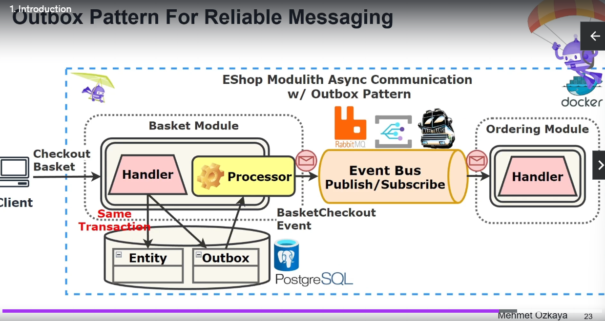

# NET Backend Bootcamp
.NET Backend Bootcamp

## Why we need Modular Monoliths
- Traditionally, monolithic architectures were the standard.
- All components were earlier  in single, indivisible unit and everything was centralized.
- It simplified initial deployment and development.
- As apps grew in size and complexity, challenges multiplied.
- Updating one part of application meant deploying the whole app
- Scaling could not be done individually.
- So it led to rise of microservices.
- They are independently deployable services and communicate via lightweight mechanisms
- They are easier to update and scale.
- Distributed nature of microservices led to complexities in managing network latency, data consistency and fault tolerance.
- It complicated the development environment and operational overhead.
- So modular monolith architecture emerged as a bridge between monoliths and microservices. 
- Offers the agility of microservices.
- MMs breaks down a traditional monolith into well defined loosely coupled modules that are easier to develop and maintain
- Each module is designed around a business domain, but run in the same application process.
- Simplify data management and transactional integrity.
- Start with MM and gradually evolve to microservices.
- 
- Secure APIs with Keycloak using Open ID Connect and Bearer Tokens
- Implement outbox pattern for reliable messaging between modules.
- 
- 
- 
- 
- 
- 
- 
- 
- 
- 

## Characteristics of Monolithic Architecture
- 
- What is wrong with traditional monolithic architecture
- Scalability is a big problem, scale everything or none at all
- Leads to inefficient resource utilization
- Becomes complex with time.
- Tight coupling...change in one part may affect other parts of the application.
- Makes overall development process slower 
- Expensive to maintain and difficult to add new features.
- Single point of failure and rollback is difficult and risky
- Deploying updates requires downtime.
- Leads to technology lock-in
- 
- Leads to Fear Cycle.
- Most of time is spent in maintaining old application
- Responding to new business requirements is slow
- We accumulate technical debt and code quality is compromised.
- Fixing bugs is tough.
- Requires extensive testing.
- Traditional monoliths lead to a big ball of mud.

### Microservice architectural style is an approach to developing a single application as a suite of small services each running in its own process and communicating with lightweight mechanisms often an HTTP or gRPC API

- Microservice architecture is cloud native.
- Microservices have distribution tax.
- Lot of moving parts compared to monolithic application
- Prone to network latency and failures.
- Need robust retry and fallback mechanisms.
- Traditional ACID transactions are hard to implement in a distributed system
- Ensuring data consistency across multiple services is difficult.
- Eventual consistency and distributed transactions are often necessary but add complexity.
- May require data duplications
- Need to setup CI/CD for each microservice.
- Monitoring and logging is difficult.
- Need to invest in Devops automation
- Each protocol for communication has its own trade offs.
- Need consul, eureka for service discovery.
- Handling failures is difficult. Need circuit breakers.
- Difficult to setup integration tests.
- Debugging distributed systems is tough. Need Jaeger and Zipkin for distributed tracing. 

## Microservices Antipattern: Distributed Monolith.
- Here a microservices based system retains the drawbacks of a traditional monolithic architecture.
- Here services are highly dependent on each other. Change in one service require changes in another service.
- Here we need synchronized deployments. Negates benefits of microservices.
- Often we have shared databases which makes it difficult to change database schema without affecting all the dependent services.
- Makes database migrations challenging.
- Frequent synchronous calls may lead to bottlenecks.

## Why distributed monoliths happen?
- Poorly defined service boundaries.
- Lack of knowledge of domain driven design
- Sharing database schema across services.
- Migrating from monolithic application to microservices without changing code.
- 
- 

## Modular Monolith Architecture
- Bridge between Traditional Monolithic and Microservice Architectures.
- In MM architecture, application is developed as a single cohesive unit but is internally divided into well-defined, loosely coupled modules
- Maintain the simplicity of monolith but also benefits of modularity associated with microservices.
- Breaks up the code into independent modules and each module encapsulates their own features
- We will build and deploy a single app 
- But **modules represent bounded contexts** of our application domain and group features of domain contexts.
- App is divided into several modules and **each module encapsulates specific business domain.**
- **Communication between modules is through specific well defined interfaces**, reducing dependencies and enhancing maintainability.
- App is **deployed as a single unit**.
- **Communication is through direct method calls** or event mechanisms within the same application process.
- **segment database by schemas** or tables specific to each module.
- 
- Each module is a separate class library project.


## Resurgence of Modular Monolith.
- Middle Path between monolithic and microservices
- Not a new concept
- Do not want complexity of microservices.
- Want benefits of monolithic architecture with agility of microservices.
- Each module is designed a specific business domain.

## Advantages over microservices
- Eliminates complexity of communication
- Possible to achieve ACID 
- Data can be consistent
- We can have targeted scaling of specific modules
- Avoid complexity of service discovery, network latency and inter-service communication.
  
## Donot start any project with microservices.
- Every project starts off as a monolith till the need for microservices arises.
- Need to define bounded contexts.
- Martin Fowler advocates monolith first architecture.

## Starting Point for Microservices: Modular Monolith
- Companies can start with modular monolith and later spin off some modules as full fledged microservices.
- Can incrementally refactor parts of monolith into microservices.
- Need efficient resource utilization.
- Transitioning from monolith to microservices can be risky and complex.
- Avoid Big bang approach
- Gradually breakdown monolith into microservices.
- 
- Need smaller manageable changes by focusing on one module at a time.
- 
  

## Shopify has modular monolithic architecture.
- Built on ruby on rails 
- 2.8 million lines of code
- 500,000 commits.
- Engineering team made their monoliths even more modular by creating smaller, independent units of code called components.
- Shopify uses multi-layered testing approach.
- Used canary testing where changes are first deployed to a small subset of production instances.
- Deployment pipeline involves building images, deploying to canaries, monitoring metrics and rolling out changes across the global fleet.


## Bounded context pattern
- Central pattern in DDD. Helps in identifying boundaries within which a particular domain model applies.
- What are the main functionalities?
- How do different parts of the system interact?
- What are key entities and processes?
- 

## Setting up the Project
- 
- launchSettings.json file contains the various profiles for running the application.
- what is launchsettings.json ?
- launchSettings.json is a configuration file used in .NET projects, particularly for ASP.NET Core applications. It contains settings related to how the application should be launched during development.
- Profiles: Different configurations for launching the application, like IIS Express, Project, or custom profiles.
- Environment Variables: Specific environment variables that should be set when the application is run.
- Application URL: The URL at which the application will be accessible when launched.

## External vs Internal Architecture:
- 
- Internal Architectural Styles can be:
- N-Layer Architecture
- Vertical Slice Architecture
- Clean Architecture.

## Vertical Slice Architecture
- Introduced by Jimmy Bogard
- Competes with Traditional Layered architecture/onion/clean architecture.
- Aims to organize code around specific features or use cases rather than technical concerns
- A feature is implemented across all layers from UI to database
- Divides application into distinct features or functionalities.
- In contrast to traditional layered architecture where application is divided horizontally.
- 
- Application into features based slices.
- Each slice is self contained and independent.
- Reduced dependencies between different parts of application
- Each slice is its own mini application from start to finish
- Supports scalability and maintainability.
- New features can be added as a separate slice
- Allows for improved testing and deployment
- Aligns well with Agile and Devops practices.
- Simplifies refactoring and upgrades.
- Problem is there might be duplication of code across slices.
- Keeping the slices independent is tough.

## Clean Architecture
- Introduced by Uncle Bob.
- Separate concerns and create systems independent of frameworks, UI and databases.
- 
- System is more adaptable to change.
- Not tightly coupled with one framework.
- Business rules can be tested without UI or database
- UI can change easily without changing rest of the system
- Business rules is independent of database
- Business rules dont know anything about the outside world.
- Has entity layer(domain layer also called core) 
- -->Application Layer(Application specific business rules) 
- -->Interface Adapters Layer or Infrastructure Layer(Maps data from db model to domain entities.)
- -->Frameworks and Driver Layer(Contains tools like DB, Web framework)
- Systems with clean architecture are more modular, adaptable, testable and maintainable.

## Vertical Slice vs Clean Architecture.
- VSA is built around feature slices which are independent.
- CA focuses on separation of concerns and dependency rules 
- In VSA, we deliver complete features with each feature potentially touching all layers of the stack 
- CA is more structured approach where business logic is different from external concerns
- VSA well suited for agile teams working on complex apps and lot of features
- CA is ideal for large scale application where long term maintenance is paramount. 
- If priority is to develop features quickly and independently go for VSA 
- If teams need to be agile and deliver features in short cycles go for VSA 
- In microservices also , where each service is responsible for distinct feature go for VSA 


## Shared Kernel Pattern in DDD 
- Small subset of domain model is shared between multiple bounded contexts or modules 
- Includes common data structures, utility classes or services that multiple parts of the system need to use.
- Shared kernel ensures consistency and reduces duplication while maintaining clear boundaries between different modules.
- 
- Only minimal, necessary part of domain model are shared, keeping rest of module implementations decoupled.
- By using shared project we can centralize all common code and cross cutting concerns into a single location.
- This includes common nuget objects, entities and value objects.

## Dependencies Path
- 

## Wireup dependencies between modules
- DI allows an object to receive its dependencies from an external source than creating one themselves.
- Promotes loose coupling and enhances testability.
- ASP.NET Core has built in DI container.
- DI container is in Program.cs and handles lifecycle of these services, ensuring they are instantiated and disposed off correctly.
- AddTransient: Creates a new instance of the service each time it is requested.
- AddScoped: Creates new instance of service per request.
- AddSingleTon: Creates a single instance of service throughout the lifetime of the application
- 
- 
- 
- Please note we will create extension methods within each of the module like this
```c#
namespace Catalog
{
    public static class CatalogModule
    {
        public static IServiceCollection AddCatalogModule(this IServiceCollection services, IConfiguration configuration)
        {
            //Add services to the container
            //services
            //    .AddApplicationServices()
            //    .AddInfrastructureServices(configuration)
            //    .AddApiServices(configuration);
            return services;
        }
    }
}

```
- Then we will register this in Program.cs file of Api Project
```c#
builder.Services
    .AddCatalogModule(builder.Configuration)
    .AddBasketModule(builder.Configuration)
    .AddOrderingModule(builder.Configuration);

```
- Also please note that all of individual modules will require us to download nuget packages related to Microsoft.DependencyInjection.
- Rather than download these nuget packages for every project, we can download these nuget packages for the shared project and add reference for the shared project in each of our modules.
- This sort of centralizes our nuget package management within the shared module.

## Asp.net middleware and Http Request pipeline
- Middleware is a software that is assembled into an application pipeline to handle requests and responses.
- Each component in the pipeline can either handle a request or pass it on to the next middleware component.
- Middleware is a chain of delegates that can process an HttpRequest on its way in and HTTP response on its way out.
- This allows for Authentication, Logging and Error Handling.
- Aspnet core HTTP Request pipeline is a sequence of middleware components that process incoming requests and outgoing responses.
- 
- 
- HSTS (HTTP Strict Transport Security) middleware is a security feature used in web applications to enforce secure connections. 
- When implemented, it ensures that browsers only interact with your website over HTTPS, preventing protocol downgrade attacks and cookie hijacking

```c#
//Configure the HTTP request pipeline

//Use Static files
app.UseStaticFiles();

//Use Routing
app.UseRouting();

//add authentication
app.UseAuthentication();

//add authorization
app.UseAuthorization();

//define endpoints
app.UseEndpoints(endpoints =>
{
    endpoints.MapControllers();
});


```
- Think of Program.cs file into 2 parts: before building the application and second is configuring HTTP request pipeline after the application is built
- So before builder.Build() method we configure all services and dependencies.
- Then we call builder.Build() which builds the application
- Then we configure the HTTP request pipeline to configure how incoming requests and outgoing responses are handled.


## WebApplication class
- This class implements several interfaces like IHost, IApplicationBuilder, IEndpointRouterBuilder, IAsyncDisposable.
- Use it like this in each of the modules:
```c#
public static IApplicationBuilder UseCatalogModule(this IApplicationBuilder builder)
{
    //Add services to the container
    //services
    //    .AddApplicationServices()
    //    .AddInfrastructureServices(configuration)
    //    .AddApiServices(configuration);
    return builder;
}

```
- Integrate it in the Program.cs file of Api Project like this:
```c#
app
    .UseCatalogModule()
    .UseBasketModule()
    .UseOrderingModule();
```

## GlobalUsings.cs 
- Rather than clutter all our files with multiple using statements, we can create a GlobalUsings.cs file in our project and enclose all of our common using statements like this:
```c#
global using Catalog;
global using Basket;
global using Ordering;

```

## Developing Catalog Module
- 
- Domain analysis of Catalog Module should be done in 4 key areas:
  1. Domain Models ( like Product Domain Model)
  2. Application Use Cases (Listing Products, Categories)
  3. Rest API Endpoints (Get Product /product/{id}, Update Product, Add Product)
  4. Underlying Data Structures.(PostGres SQL Relational DB)
  5. CodeFirst Approach

## Catalog Architecture
- CQRS Pattern
- Mediator Pattern
- Minimal APIs and Routing in ASP.NET 8: ASP.NET 8 Minimal API simplify endpoint definition, provide lightweight syntax for routing and handling HTTP Requests
- Carter Library: Used for routing and handling HTTP requests making it easier to define API endpoints with clean and concise code.
- Mapster: Fast Configurable Object Mapper that simplifies the task of mapping objects.  
- FluentValidation: Used for input validation. 

## Folder Structure
- 

## Develop Shared Domain for Tactical DDD Abstraction.
- Eric Evans published his book in 2003.
- DDD means take a big problem and break it down into smaller problems and focus on each one.
- DDD types: Strategic and Tactical DDD 
- Strategic DDD: Understanding and modeling the business domains, subdomains etc.
- Tactical DDD: Implementation details and provides design patterns.
- Includes patterns like Entities, Value Objects, Aggregates etc. 
- DDD: Domain, SubDomain(specific expertise in main domain), Ubiquitous language(common language between developers and business), bounded context(logical boundary) and context mapping(identify bounded contexts with their logical boundaries). 
- Tactical DDD: Focuses on domain and domain logic
- Focuses on entities, value objects, aggregates and aggregate root.
- Entity is an object that is identified by its id (like a Product(ProductID) or an Order(OrderID))
- Value Object: Carries no concept of identity, has no identity: used to encapsulate complex attributes. For e.g Address(In an order, we need an address but it doesnot define the identity of the order)
- Aggregates: cluster of domain objects treated as a single Unit. Defines a boundary around related objects.
- For e.g Order can be an aggregate containing OrderItems, PaymentDetails etc. Consistency of an order like total price calculation, stock validations is maintained in Aggregate boundaries. 
- Aggregate Root: Main entity in an aggregate through which external objects interact with the aggregate. 
- For e.g Order Aggregate: Order itself is an aggregate root, External objects interact with Order to affect changes within the Aggregate.
- 

## Common Entity in Shared Project to be implemented by all entities
```c#

//For Entity of Type T, specify the ID
public interface IEntity<T> : IEntity
{
    public T Id { get; set; }
}


//Base properties for all entities
public interface IEntity
{
    public DateTime? CreatedAt { get; set; }
    public string? CreatedBy { get; set; }
    public DateTime? LastModified { get; set; }
    public string? LastModifiedBy { get; set; }
}


//Implement IEntity and specify Base class for all entities
//Serves as base class for all entities providing common properties like Id, CreatedAt, LastModified etc
public abstract class Entity<T> : IEntity<T>
{
    public T Id { get ; set ; }
    public DateTime? CreatedAt { get ; set; }
    public string? CreatedBy { get ; set ; }
    public DateTime? LastModified { get; set; }
    public string? LastModifiedBy { get; set; }
}


```

## Domain Events 
- Significant occurrences within the domain that we want to track
- For e.g an event like ProductPriceChanged would be a domain event indicating price of product has changed. 

## Mediatr INotification Interface
- Mediatr allows us to send messages(commands, events) within our app.
- INotification is an interface in Mediatr used to define events that can be published and handled asynchronously. 
- Raising and Dispatching Domain Events.
- Creating a base interface for Domain Events 
```c#
 public interface IDomainEvent: INotification
 {
     Guid EventId => Guid.NewGuid();
     public DateTime OccurredOn => DateTime.Now;

     public string EventType => GetType().AssemblyQualifiedName;
 }

```
- 
- Creating interfaces and implementation for creating and returning domain events 
```c#
public interface IAggregate<T>:IAggregate,IEntity<T>
{

}
public interface IAggregate: IEntity
{
    IReadOnlyList<IDomainEvent> DomainEvents { get; }
    IDomainEvent[] ClearDomainEvents();
}


//Main the List of Domain Events for the Aggregate
public abstract class Aggregate<TId> : Entity<TId>, IAggregate<TId>
{
    private readonly List<IDomainEvent> _domainEvents = new();
    public IReadOnlyList<IDomainEvent> DomainEvents => _domainEvents.AsReadOnly();

    public void AddDomainEvent(IDomainEvent domainEvent)
    {
        _domainEvents.Add(domainEvent);
    }

    public IDomainEvent[] ClearDomainEvents()
    {
        IDomainEvent[] dequeuedEvents = _domainEvents.ToArray();
        _domainEvents.Clear();
        return dequeuedEvents;
    }
    
}

```

## Develop Catalog Domain with Product Domain Entity Models 
- Creating the Product Entity:
```c#
public class Product : Entity<Guid>
{
    public string Name { get; set; } = default!;
    public List<string> Category { get; set; } = new();
    public string Description { get; set; } = default!;
    public string ImageFile { get; set; } = default!;
    public decimal Price { get; set; }
}

```

## Anemic and Rich Domain Model Entity
- Anemic entities are those which have little or no business logic
- Data structures with getters and setters 
- Business rules and behaviors are implemented outside the entity in service layer 
- Example is 
- Rich Domain Model entity encapsulate both data and behavior. 
- They have enriched entities with methods that embody business rules and domain logic 
- Example is 
- In Anemic domain model, business logic is scattered across services which can cause issues with maintainability and understanding business logic.
- Rich domain model encapsulate business logic within entities. Can be complex to design but is more maintainable.
- So for Orders we should create a Rich Domain Model like this: 
  

## Developing Rich Domain Model for Product Entity
```c#
public class Product : Entity<Guid>
{
    //make property setters private to enforce encapsulation
    public string Name { get; private set; } = default!;
    public List<string> Category { get; private set; } = new();
    public string Description { get; private set; } = default!;
    public string ImageFile { get; private set; } = default!;
    public decimal Price { get; private set; }

    //Add create method for initializing product entities.
    public static Product Create(Guid id, string name, List<string> category, string description, string imageFile, decimal price)
    {
        //Validate inputs
        //Ensures product entity is always created in a valid state
        ArgumentException.ThrowIfNullOrEmpty(name);
        ArgumentOutOfRangeException.ThrowIfNegativeOrZero(price);
        var product = new Product()
        {
            Id = id,
            Name = name,
            Category = category,
            Description = description,
            ImageFile = imageFile,
            Price = price
        };
        return product; 
    }
    
    //Add an update method for modifying Product entities.
    public void Update(string name, List<string> category, string description, string imageFile, decimal price)
    {
        //Validate inputs
        ArgumentException.ThrowIfNullOrEmpty(name);
        ArgumentOutOfRangeException.ThrowIfNegativeOrZero(price);

        Name = name;
        Category = category;
        Description = description;
        ImageFile = imageFile;
        Price = price;

        //TODO: if price is changed, raise ProductPriceChanged domain event
    }
}

```

## Domain vs Integration Events 
- Domain represent something that happened in the past and other parts of the same service boundary in the same domain need to react to these changes.
- Domain event is a business event that occurs within the domain model. Represents side effect of domain operation.
- When an order is placed, an OrderPlaced event is triggered. 
- Trigger side effects and notify other parts of the system about changes in the domain.
- Communicate change to external handlers which may trigger further events.
- 
- Domain Events are published and consumed in the same domain. 
- They are sent using an in-memory message bus
- Happen in the same domain or microservice
- Example is OrderPlaced Event 
- Indicate something has happened in the aggregate 
- Integration Events are used to communicate state changes or events between different contexts or microservices
- Sent via Message Broker.
- For e.g after OrderPlacedEvent, an OrderPlacedIntegrationEvent may be published to RabbitMq that is consumed by other microservices like Shipping.
- 
- Domain events happen synchronously whereas Integration Events are sent asynchronously.
### Key Differences between class and record
- Immutability:
    Classes are mutable by default, allowing their state to change.
    Records are immutable by default, making them ideal for scenarios where you need read-only data.
- Default Equality:
    Classes use reference equality by default, which means two objects are considered equal if they reference the same memory location.
    Records use value equality by default, meaning two records are considered equal if their values are the same.
- Syntax:
    Classes typically require more boilerplate code to define properties and constructors.
    Records provide a concise syntax for defining data objects, especially with positional parameters.

```c#
namespace Catalog.Products.Events
{
    public record ProductPriceChangedEvent(Product product) : IDomainEvent;
}

```

## Change Product from Entity to Aggregate to allow raising Domain Events 
```c#
public class Product : Aggregate<Guid>
{
    //make property setters private to enforce encapsulation
    public string Name { get; private set; } = default!;
    public List<string> Category { get; private set; } = new();
    public string Description { get; private set; } = default!;
    public string ImageFile { get; private set; } = default!;
    public decimal Price { get; private set; }

    //Add create method for initializing product entities.
    public static Product Create(Guid id, string name, List<string> category, string description, string imageFile, decimal price)
    {
        //Validate inputs
        //Ensures product entity is always created in a valid state
        ArgumentException.ThrowIfNullOrEmpty(name);
        ArgumentOutOfRangeException.ThrowIfNegativeOrZero(price);
        var product = new Product()
        {
            Id = id,
            Name = name,
            Category = category,
            Description = description,
            ImageFile = imageFile,
            Price = price
        };
        product.AddDomainEvent(new ProductCreatedEvent(product));
        return product; 
    }

   
    
    //Add an update method for modifying Product entities.
    public void Update(string name, List<string> category, string description, string imageFile, decimal price)
    {
        //Validate inputs
        ArgumentException.ThrowIfNullOrEmpty(name);
        ArgumentOutOfRangeException.ThrowIfNegativeOrZero(price);

        Name = name;
        Category = category;
        Description = description;
        ImageFile = imageFile;
        Price = price;


        //if price is changed, raise ProductPriceChanged domain event
        if(Price != price)
        {  
            Price = price;
            AddDomainEvent(new ProductPriceChangedEvent(this));
        }
        
    }
}

```