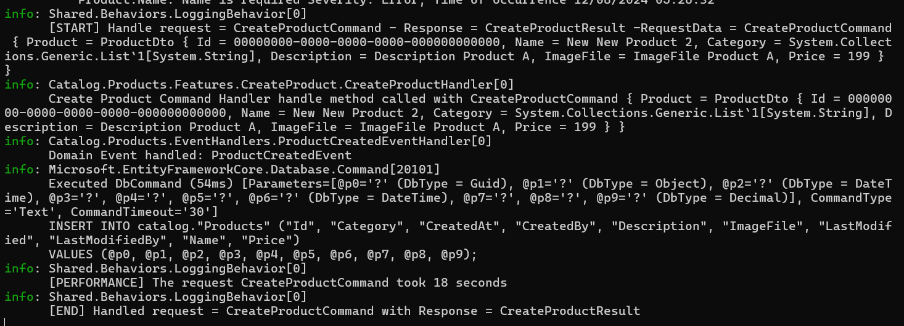

# NET Backend Bootcamp
.NET Backend Bootcamp

## Why we need Modular Monoliths
- Traditionally, monolithic architectures were the standard.
- All components were earlier  in single, indivisible unit and everything was centralized.
- It simplified initial deployment and development.
- As apps grew in size and complexity, challenges multiplied.
- Updating one part of application meant deploying the whole app
- Scaling could not be done individually.
- So it led to rise of microservices.
- They are independently deployable services and communicate via lightweight mechanisms
- They are easier to update and scale.
- Distributed nature of microservices led to complexities in managing network latency, data consistency and fault tolerance.
- It complicated the development environment and operational overhead.
- So modular monolith architecture emerged as a bridge between monoliths and microservices. 
- Offers the agility of microservices.
- MMs breaks down a traditional monolith into well defined loosely coupled modules that are easier to develop and maintain
- Each module is designed around a business domain, but run in the same application process.
- Simplify data management and transactional integrity.
- Start with MM and gradually evolve to microservices.
- 
- Secure APIs with Keycloak using Open ID Connect and Bearer Tokens
- Implement outbox pattern for reliable messaging between modules.
- 
- 
- 
- 
- 
- 
- 
- 
- 
- 

## Characteristics of Monolithic Architecture
- 
- What is wrong with traditional monolithic architecture
- Scalability is a big problem, scale everything or none at all
- Leads to inefficient resource utilization
- Becomes complex with time.
- Tight coupling...change in one part may affect other parts of the application.
- Makes overall development process slower 
- Expensive to maintain and difficult to add new features.
- Single point of failure and rollback is difficult and risky
- Deploying updates requires downtime.
- Leads to technology lock-in
- 
- Leads to Fear Cycle.
- Most of time is spent in maintaining old application
- Responding to new business requirements is slow
- We accumulate technical debt and code quality is compromised.
- Fixing bugs is tough.
- Requires extensive testing.
- Traditional monoliths lead to a big ball of mud.

### Microservice architectural style is an approach to developing a single application as a suite of small services each running in its own process and communicating with lightweight mechanisms often an HTTP or gRPC API

- Microservice architecture is cloud native.
- Microservices have distribution tax.
- Lot of moving parts compared to monolithic application
- Prone to network latency and failures.
- Need robust retry and fallback mechanisms.
- Traditional ACID transactions are hard to implement in a distributed system
- Ensuring data consistency across multiple services is difficult.
- Eventual consistency and distributed transactions are often necessary but add complexity.
- May require data duplications
- Need to setup CI/CD for each microservice.
- Monitoring and logging is difficult.
- Need to invest in Devops automation
- Each protocol for communication has its own trade offs.
- Need consul, eureka for service discovery.
- Handling failures is difficult. Need circuit breakers.
- Difficult to setup integration tests.
- Debugging distributed systems is tough. Need Jaeger and Zipkin for distributed tracing. 

## Microservices Antipattern: Distributed Monolith.
- Here a microservices based system retains the drawbacks of a traditional monolithic architecture.
- Here services are highly dependent on each other. Change in one service require changes in another service.
- Here we need synchronized deployments. Negates benefits of microservices.
- Often we have shared databases which makes it difficult to change database schema without affecting all the dependent services.
- Makes database migrations challenging.
- Frequent synchronous calls may lead to bottlenecks.

## Why distributed monoliths happen?
- Poorly defined service boundaries.
- Lack of knowledge of domain driven design
- Sharing database schema across services.
- Migrating from monolithic application to microservices without changing code.
- 
- 

## Modular Monolith Architecture
- Bridge between Traditional Monolithic and Microservice Architectures.
- In MM architecture, application is developed as a single cohesive unit but is internally divided into well-defined, loosely coupled modules
- Maintain the simplicity of monolith but also benefits of modularity associated with microservices.
- Breaks up the code into independent modules and each module encapsulates their own features
- We will build and deploy a single app 
- But **modules represent bounded contexts** of our application domain and group features of domain contexts.
- App is divided into several modules and **each module encapsulates specific business domain.**
- **Communication between modules is through specific well defined interfaces**, reducing dependencies and enhancing maintainability.
- App is **deployed as a single unit**.
- **Communication is through direct method calls** or event mechanisms within the same application process.
- **segment database by schemas** or tables specific to each module.
- 
- Each module is a separate class library project.


## Resurgence of Modular Monolith.
- Middle Path between monolithic and microservices
- Not a new concept
- Do not want complexity of microservices.
- Want benefits of monolithic architecture with agility of microservices.
- Each module is designed a specific business domain.

## Advantages over microservices
- Eliminates complexity of communication
- Possible to achieve ACID 
- Data can be consistent
- We can have targeted scaling of specific modules
- Avoid complexity of service discovery, network latency and inter-service communication.
  
## Donot start any project with microservices.
- Every project starts off as a monolith till the need for microservices arises.
- Need to define bounded contexts.
- Martin Fowler advocates monolith first architecture.

## Starting Point for Microservices: Modular Monolith
- Companies can start with modular monolith and later spin off some modules as full fledged microservices.
- Can incrementally refactor parts of monolith into microservices.
- Need efficient resource utilization.
- Transitioning from monolith to microservices can be risky and complex.
- Avoid Big bang approach
- Gradually breakdown monolith into microservices.
- 
- Need smaller manageable changes by focusing on one module at a time.
- 
  

## Shopify has modular monolithic architecture.
- Built on ruby on rails 
- 2.8 million lines of code
- 500,000 commits.
- Engineering team made their monoliths even more modular by creating smaller, independent units of code called components.
- Shopify uses multi-layered testing approach.
- Used canary testing where changes are first deployed to a small subset of production instances.
- Deployment pipeline involves building images, deploying to canaries, monitoring metrics and rolling out changes across the global fleet.


## Bounded context pattern
- Central pattern in DDD. Helps in identifying boundaries within which a particular domain model applies.
- What are the main functionalities?
- How do different parts of the system interact?
- What are key entities and processes?
- 

## Setting up the Project
- 
- launchSettings.json file contains the various profiles for running the application.
- what is launchsettings.json ?
- launchSettings.json is a configuration file used in .NET projects, particularly for ASP.NET Core applications. It contains settings related to how the application should be launched during development.
- Profiles: Different configurations for launching the application, like IIS Express, Project, or custom profiles.
- Environment Variables: Specific environment variables that should be set when the application is run.
- Application URL: The URL at which the application will be accessible when launched.

## External vs Internal Architecture:
- 
- Internal Architectural Styles can be:
- N-Layer Architecture
- Vertical Slice Architecture
- Clean Architecture.

## Vertical Slice Architecture
- Introduced by Jimmy Bogard
- Competes with Traditional Layered architecture/onion/clean architecture.
- Aims to organize code around specific features or use cases rather than technical concerns
- A feature is implemented across all layers from UI to database
- Divides application into distinct features or functionalities.
- In contrast to traditional layered architecture where application is divided horizontally.
- 
- Application into features based slices.
- Each slice is self contained and independent.
- Reduced dependencies between different parts of application
- Each slice is its own mini application from start to finish
- Supports scalability and maintainability.
- New features can be added as a separate slice
- Allows for improved testing and deployment
- Aligns well with Agile and Devops practices.
- Simplifies refactoring and upgrades.
- Problem is there might be duplication of code across slices.
- Keeping the slices independent is tough.

## Clean Architecture
- Introduced by Uncle Bob.
- Separate concerns and create systems independent of frameworks, UI and databases.
- 
- System is more adaptable to change.
- Not tightly coupled with one framework.
- Business rules can be tested without UI or database
- UI can change easily without changing rest of the system
- Business rules is independent of database
- Business rules dont know anything about the outside world.
- Has entity layer(domain layer also called core) 
- -->Application Layer(Application specific business rules) 
- -->Interface Adapters Layer or Infrastructure Layer(Maps data from db model to domain entities.)
- -->Frameworks and Driver Layer(Contains tools like DB, Web framework)
- Systems with clean architecture are more modular, adaptable, testable and maintainable.

## Vertical Slice vs Clean Architecture.
- VSA is built around feature slices which are independent.
- CA focuses on separation of concerns and dependency rules 
- In VSA, we deliver complete features with each feature potentially touching all layers of the stack 
- CA is more structured approach where business logic is different from external concerns
- VSA well suited for agile teams working on complex apps and lot of features
- CA is ideal for large scale application where long term maintenance is paramount. 
- If priority is to develop features quickly and independently go for VSA 
- If teams need to be agile and deliver features in short cycles go for VSA 
- In microservices also , where each service is responsible for distinct feature go for VSA 


## Shared Kernel Pattern in DDD 
- Small subset of domain model is shared between multiple bounded contexts or modules 
- Includes common data structures, utility classes or services that multiple parts of the system need to use.
- Shared kernel ensures consistency and reduces duplication while maintaining clear boundaries between different modules.
- 
- Only minimal, necessary part of domain model are shared, keeping rest of module implementations decoupled.
- By using shared project we can centralize all common code and cross cutting concerns into a single location.
- This includes common nuget objects, entities and value objects.

## Dependencies Path
- 

## Wireup dependencies between modules
- DI allows an object to receive its dependencies from an external source than creating one themselves.
- Promotes loose coupling and enhances testability.
- ASP.NET Core has built in DI container.
- DI container is in Program.cs and handles lifecycle of these services, ensuring they are instantiated and disposed off correctly.
- AddTransient: Creates a new instance of the service each time it is requested.
- AddScoped: Creates new instance of service per request.
- AddSingleTon: Creates a single instance of service throughout the lifetime of the application
- 
- 
- 
- Please note we will create extension methods within each of the module like this
```c#
namespace Catalog
{
    public static class CatalogModule
    {
        public static IServiceCollection AddCatalogModule(this IServiceCollection services, IConfiguration configuration)
        {
            //Add services to the container
            //services
            //    .AddApplicationServices()
            //    .AddInfrastructureServices(configuration)
            //    .AddApiServices(configuration);
            return services;
        }
    }
}

```
- Then we will register this in Program.cs file of Api Project
```c#
builder.Services
    .AddCatalogModule(builder.Configuration)
    .AddBasketModule(builder.Configuration)
    .AddOrderingModule(builder.Configuration);

```
- Also please note that all of individual modules will require us to download nuget packages related to Microsoft.DependencyInjection.
- Rather than download these nuget packages for every project, we can download these nuget packages for the shared project and add reference for the shared project in each of our modules.
- This sort of centralizes our nuget package management within the shared module.

## Asp.net middleware and Http Request pipeline
- Middleware is a software that is assembled into an application pipeline to handle requests and responses.
- Each component in the pipeline can either handle a request or pass it on to the next middleware component.
- Middleware is a chain of delegates that can process an HttpRequest on its way in and HTTP response on its way out.
- This allows for Authentication, Logging and Error Handling.
- Aspnet core HTTP Request pipeline is a sequence of middleware components that process incoming requests and outgoing responses.
- 
- 
- HSTS (HTTP Strict Transport Security) middleware is a security feature used in web applications to enforce secure connections. 
- When implemented, it ensures that browsers only interact with your website over HTTPS, preventing protocol downgrade attacks and cookie hijacking

```c#
//Configure the HTTP request pipeline

//Use Static files
app.UseStaticFiles();

//Use Routing
app.UseRouting();

//add authentication
app.UseAuthentication();

//add authorization
app.UseAuthorization();

//define endpoints
app.UseEndpoints(endpoints =>
{
    endpoints.MapControllers();
});


```
- Think of Program.cs file into 2 parts: before building the application and second is configuring HTTP request pipeline after the application is built
- So before builder.Build() method we configure all services and dependencies.
- Then we call builder.Build() which builds the application
- Then we configure the HTTP request pipeline to configure how incoming requests and outgoing responses are handled.


## WebApplication class
- This class implements several interfaces like IHost, IApplicationBuilder, IEndpointRouterBuilder, IAsyncDisposable.
- Use it like this in each of the modules:
```c#
public static IApplicationBuilder UseCatalogModule(this IApplicationBuilder builder)
{
    //Add services to the container
    //services
    //    .AddApplicationServices()
    //    .AddInfrastructureServices(configuration)
    //    .AddApiServices(configuration);
    return builder;
}

```
- Integrate it in the Program.cs file of Api Project like this:
```c#
app
    .UseCatalogModule()
    .UseBasketModule()
    .UseOrderingModule();
```

## GlobalUsings.cs 
- Rather than clutter all our files with multiple using statements, we can create a GlobalUsings.cs file in our project and enclose all of our common using statements like this:
```c#
global using Catalog;
global using Basket;
global using Ordering;

```

## Developing Catalog Module
- 
- Domain analysis of Catalog Module should be done in 4 key areas:
  1. Domain Models ( like Product Domain Model)
  2. Application Use Cases (Listing Products, Categories)
  3. Rest API Endpoints (Get Product /product/{id}, Update Product, Add Product)
  4. Underlying Data Structures.(PostGres SQL Relational DB)
  5. CodeFirst Approach

## Catalog Architecture
- CQRS Pattern
- Mediator Pattern
- Minimal APIs and Routing in ASP.NET 8: ASP.NET 8 Minimal API simplify endpoint definition, provide lightweight syntax for routing and handling HTTP Requests
- Carter Library: Used for routing and handling HTTP requests making it easier to define API endpoints with clean and concise code.
- Mapster: Fast Configurable Object Mapper that simplifies the task of mapping objects.  
- FluentValidation: Used for input validation. 

## Folder Structure
- 

## Develop Shared Domain for Tactical DDD Abstraction.
- Eric Evans published his book in 2003.
- DDD means take a big problem and break it down into smaller problems and focus on each one.
- DDD types: Strategic and Tactical DDD 
- Strategic DDD: Understanding and modeling the business domains, subdomains etc.
- Tactical DDD: Implementation details and provides design patterns.
- Includes patterns like Entities, Value Objects, Aggregates etc. 
- DDD: Domain, SubDomain(specific expertise in main domain), Ubiquitous language(common language between developers and business), bounded context(logical boundary) and context mapping(identify bounded contexts with their logical boundaries). 
- Tactical DDD: Focuses on domain and domain logic
- Focuses on entities, value objects, aggregates and aggregate root.
- Entity is an object that is identified by its id (like a Product(ProductID) or an Order(OrderID))
- Value Object: Carries no concept of identity, has no identity: used to encapsulate complex attributes. For e.g Address(In an order, we need an address but it doesnot define the identity of the order)
- Aggregates: cluster of domain objects treated as a single Unit. Defines a boundary around related objects.
- For e.g Order can be an aggregate containing OrderItems, PaymentDetails etc. Consistency of an order like total price calculation, stock validations is maintained in Aggregate boundaries. 
- Aggregate Root: Main entity in an aggregate through which external objects interact with the aggregate. 
- For e.g Order Aggregate: Order itself is an aggregate root, External objects interact with Order to affect changes within the Aggregate.
- 

## Common Entity in Shared Project to be implemented by all entities
```c#

//For Entity of Type T, specify the ID
public interface IEntity<T> : IEntity
{
    public T Id { get; set; }
}


//Base properties for all entities
public interface IEntity
{
    public DateTime? CreatedAt { get; set; }
    public string? CreatedBy { get; set; }
    public DateTime? LastModified { get; set; }
    public string? LastModifiedBy { get; set; }
}


//Implement IEntity and specify Base class for all entities
//Serves as base class for all entities providing common properties like Id, CreatedAt, LastModified etc
public abstract class Entity<T> : IEntity<T>
{
    public T Id { get ; set ; }
    public DateTime? CreatedAt { get ; set; }
    public string? CreatedBy { get ; set ; }
    public DateTime? LastModified { get; set; }
    public string? LastModifiedBy { get; set; }
}


```

## Domain Events 
- Significant occurrences within the domain that we want to track
- For e.g an event like ProductPriceChanged would be a domain event indicating price of product has changed. 

## Mediatr INotification Interface
- Mediatr allows us to send messages(commands, events) within our app.
- INotification is an interface in Mediatr used to define events that can be published and handled asynchronously. 
- Raising and Dispatching Domain Events.
- Creating a base interface for Domain Events 
```c#
 public interface IDomainEvent: INotification
 {
     Guid EventId => Guid.NewGuid();
     public DateTime OccurredOn => DateTime.Now;

     public string EventType => GetType().AssemblyQualifiedName;
 }

```
- 
- Creating interfaces and implementation for creating and returning domain events 
```c#
public interface IAggregate<T>:IAggregate,IEntity<T>
{

}
public interface IAggregate: IEntity
{
    IReadOnlyList<IDomainEvent> DomainEvents { get; }
    IDomainEvent[] ClearDomainEvents();
}


//Main the List of Domain Events for the Aggregate
public abstract class Aggregate<TId> : Entity<TId>, IAggregate<TId>
{
    private readonly List<IDomainEvent> _domainEvents = new();
    public IReadOnlyList<IDomainEvent> DomainEvents => _domainEvents.AsReadOnly();

    public void AddDomainEvent(IDomainEvent domainEvent)
    {
        _domainEvents.Add(domainEvent);
    }

    public IDomainEvent[] ClearDomainEvents()
    {
        IDomainEvent[] dequeuedEvents = _domainEvents.ToArray();
        _domainEvents.Clear();
        return dequeuedEvents;
    }
    
}

```

## Develop Catalog Domain with Product Domain Entity Models 
- Creating the Product Entity:
```c#
public class Product : Entity<Guid>
{
    public string Name { get; set; } = default!;
    public List<string> Category { get; set; } = new();
    public string Description { get; set; } = default!;
    public string ImageFile { get; set; } = default!;
    public decimal Price { get; set; }
}

```

## Anemic and Rich Domain Model Entity
- Anemic entities are those which have little or no business logic
- Data structures with getters and setters 
- Business rules and behaviors are implemented outside the entity in service layer 
- Example is 
- Rich Domain Model entity encapsulate both data and behavior. 
- They have enriched entities with methods that embody business rules and domain logic 
- Example is 
- In Anemic domain model, business logic is scattered across services which can cause issues with maintainability and understanding business logic.
- Rich domain model encapsulate business logic within entities. Can be complex to design but is more maintainable.
- So for Orders we should create a Rich Domain Model like this: 
  

## Developing Rich Domain Model for Product Entity
```c#
public class Product : Entity<Guid>
{
    //make property setters private to enforce encapsulation
    public string Name { get; private set; } = default!;
    public List<string> Category { get; private set; } = new();
    public string Description { get; private set; } = default!;
    public string ImageFile { get; private set; } = default!;
    public decimal Price { get; private set; }

    //Add create method for initializing product entities.
    public static Product Create(Guid id, string name, List<string> category, string description, string imageFile, decimal price)
    {
        //Validate inputs
        //Ensures product entity is always created in a valid state
        ArgumentException.ThrowIfNullOrEmpty(name);
        ArgumentOutOfRangeException.ThrowIfNegativeOrZero(price);
        var product = new Product()
        {
            Id = id,
            Name = name,
            Category = category,
            Description = description,
            ImageFile = imageFile,
            Price = price
        };
        return product; 
    }
    
    //Add an update method for modifying Product entities.
    public void Update(string name, List<string> category, string description, string imageFile, decimal price)
    {
        //Validate inputs
        ArgumentException.ThrowIfNullOrEmpty(name);
        ArgumentOutOfRangeException.ThrowIfNegativeOrZero(price);

        Name = name;
        Category = category;
        Description = description;
        ImageFile = imageFile;
        Price = price;

        //TODO: if price is changed, raise ProductPriceChanged domain event
    }
}

```

## Domain vs Integration Events 
- Domain represent something that happened in the past and other parts of the same service boundary in the same domain need to react to these changes.
- Domain event is a business event that occurs within the domain model. Represents side effect of domain operation.
- When an order is placed, an OrderPlaced event is triggered. 
- Trigger side effects and notify other parts of the system about changes in the domain.
- Communicate change to external handlers which may trigger further events.
- 
- Domain Events are published and consumed in the same domain. 
- They are sent using an in-memory message bus
- Happen in the same domain or microservice
- Example is OrderPlaced Event 
- Indicate something has happened in the aggregate 
- Integration Events are used to communicate state changes or events between different contexts or microservices
- Sent via Message Broker.
- For e.g after OrderPlacedEvent, an OrderPlacedIntegrationEvent may be published to RabbitMq that is consumed by other microservices like Shipping.
- 
- Domain events happen synchronously whereas Integration Events are sent asynchronously.
### Key Differences between class and record
- Immutability:
    Classes are mutable by default, allowing their state to change.
    Records are immutable by default, making them ideal for scenarios where you need read-only data.
- Default Equality:
    Classes use reference equality by default, which means two objects are considered equal if they reference the same memory location.
    Records use value equality by default, meaning two records are considered equal if their values are the same.
- Syntax:
    Classes typically require more boilerplate code to define properties and constructors.
    Records provide a concise syntax for defining data objects, especially with positional parameters.

```c#
namespace Catalog.Products.Events
{
    public record ProductPriceChangedEvent(Product product) : IDomainEvent;
}

```

## Change Product from Entity to Aggregate to allow raising Domain Events 
```c#
public class Product : Aggregate<Guid>
{
    //make property setters private to enforce encapsulation
    public string Name { get; private set; } = default!;
    public List<string> Category { get; private set; } = new();
    public string Description { get; private set; } = default!;
    public string ImageFile { get; private set; } = default!;
    public decimal Price { get; private set; }

    //Add create method for initializing product entities.
    public static Product Create(Guid id, string name, List<string> category, string description, string imageFile, decimal price)
    {
        //Validate inputs
        //Ensures product entity is always created in a valid state
        ArgumentException.ThrowIfNullOrEmpty(name);
        ArgumentOutOfRangeException.ThrowIfNegativeOrZero(price);
        var product = new Product()
        {
            Id = id,
            Name = name,
            Category = category,
            Description = description,
            ImageFile = imageFile,
            Price = price
        };
        product.AddDomainEvent(new ProductCreatedEvent(product));
        return product; 
    }

   
    
    //Add an update method for modifying Product entities.
    public void Update(string name, List<string> category, string description, string imageFile, decimal price)
    {
        //Validate inputs
        ArgumentException.ThrowIfNullOrEmpty(name);
        ArgumentOutOfRangeException.ThrowIfNegativeOrZero(price);

        Name = name;
        Category = category;
        Description = description;
        ImageFile = imageFile;
        Price = price;


        //if price is changed, raise ProductPriceChanged domain event
        if(Price != price)
        {  
            Price = price;
            AddDomainEvent(new ProductPriceChangedEvent(this));
        }
        
    }
}

```

## Data Management of Modular Monolith
- Why Data Isolation is important ?
- Key aspect of modular monolith
- Maintainability
- Scalability
- Security
- Conflict Reduction (ensures data integrity)

### Data Isolation Strategies
- Separate Table (simple to implement and manage and easy to query, but have limited isolation and it is hard to enforce boundaries)
- Separate Schema (balance between isolation and manageability, easy to enforce boundaries but is more complex and shared databases can be a bottleneck)
- Separate Database (better isolation, independent scaling and maintenance, but higher cost of operation and cross module queries become complex)
- Separate Persistence (choose best storage technology but has significant complexity and operational overhead)

## Why DB schema separation is important 
- In MM architecture, maintaining clear boundaries between modules is important.
- Database schema separation is a practice that helps achieve this by isolating data of each module within its own schema.
- We will follow separate schema approach. Makes it clear which data belongs to which module.
- 
- Changes in one module schema donot affect other 
- Reduces complexity of cross module queries.
- Shared database resources can be optimized more effectively. 
- EFCore helps us to configure separate schema approach easily.
- 
- We will use multiple DBContexts for each of our modules
- 

## What are backing services for cloud-native architectures?
- They are external components that applications depend on for their operation
- 
- Provide support for various functionalities like storage, messaging, caching and authentication 
- These resources are external to the application
- In cloud native application, they are decoupled from the applications.

## We will use docker-compose to setup our PostgreSql database

## Develop Shared and Catalog Data-Infrastructure with EF Core CodeFirst
- Code First Approach, Migrations and Postgresql
- Install EF Core Nuget packages in shared infrastructure
- Develop EFCore DBContext for storing entities in Catalog Infrastructure
- EFCore Postgresql connection string in appsettings.json 
- Create and apply EFCore Migrations for CatalogDbContext.
- Auto Migrate EFCore entities to Postgresql DB on application startup
- Seed EShopDb Product Data on application startup just after UseMigration 
- **EFCore Interceptors**: Save Changes Interceptor for Auditing Entities.
- Dispatch Domain Events with EFCore SaveChanges interceptor.
- EFCore is a lightweight data access technology
- It can work as ORM
- Install Postgressql NpgSql Database Provider nuget packages. 
- In EFCore we have EntityFrameworkCore.Design and EntityFrameworkCore.Tools packages
- 
- 
- 
- 
- 
- To automatically apply migrations use UseMigration command 
- We can define SeedDataAsync method
  
## Setting up DbContext for Catalog Module 
```c#
public class CatalogDbContext: DbContext
{
    public CatalogDbContext(DbContextOptions options ):base(options)
    {
        
    }

    public DbSet<Product> Products => Set<Product>();
}

```
- In Entity Framework Core (EF Core), Set<T> is used to interact with a specific entity type in the database. It's part of the DbContext class, and it provides a way to query and save instances of the entity type T.
- When you call Set<T>() on a DbContext instance, it returns a DbSet<T> object, which represents the collection of all entities in the context, or that can be queried from the database, of the specified type.
- In the CatalogDbContext class, we use .Set<Product>() to get all Product entities from the database.
- Using Set<T>() is particularly useful when you want to write generic methods that can operate on any entity type without knowing the specific DbSet property names.

## Mapping Domain Objects to EFCore Columns
- We will use EntityTypeConfiguration for this purpose 
- EntityTypeConfiguration is a class used in Entity Framework (EF) Core to configure the mappings between your entity classes and the database schema. This configuration class is especially useful when you want to customize the database schema without relying solely on data annotations.
- Create a ProductConfiguration Class like this:
```c#
public class ProductConfiguration : IEntityTypeConfiguration<Product>
{
    public void Configure(EntityTypeBuilder<Product> builder)
    {
        builder.HasKey(x=>x.Id); 
        builder.Property(x => x.Name).HasMaxLength(50).IsRequired();
        builder.Property(x=>x.Category).IsRequired();
        builder.Property(x => x.Description).HasMaxLength(200);
        builder.Property(x=>x.ImageFile).HasMaxLength(100);
        builder.Property(x=>x.Price).IsRequired();
        
    }
}

```
- We can apply configurations in our Db Context like this
```c#
public class CatalogDbContext: DbContext
{
    public CatalogDbContext(DbContextOptions options):base(options)
    {
        
    }

    public DbSet<Product> Products => Set<Product>();

    protected override void OnModelCreating(ModelBuilder builder)
    {        
        //For Data Isolation, we use separate schema model, so we define a schema here
        builder.HasDefaultSchema("catalog");
        builder.ApplyConfigurationsFromAssembly(Assembly.GetExecutingAssembly());
        base.OnModelCreating(builder);
    }
}


```
- Register Catalog Db Context
```c#
services.AddDbContext<CatalogDbContext>(options =>
options.UseNpgsql(connectionString));

```

## EFCore Migrations
- Used for managing database schema changes in an application's lifecycle.
- Enable a developer to evolve a database schema in a controlled and consistent way in line with domain model changes
- Migrations provide a way to incrementally update the database schema so that it is in sync with application's data model 
- EFCore compares current model against snapshot of the previous model to find differences and generate migration source files.
- We have EF Migration History table.
- 
- We need to setup the startup project correctly before running and creating migrations
- This is because EF Core tools will look for database related configurations like connection strings in the startup project 
- In our case, Api Project has appsettings.json which has connection string 
- We also need to set the Target Project correctly.
```shell
Add-Migration InitialCreate -OutputDir Data/Migrations -Project Catalog -StartupProject Api
```
- When we are running migrations, we dont want to keep calling the Update-database command again and again.
- So we will run create a method in UseCatalogModule to run the migrations on application startup 
```c#
public static IApplicationBuilder UseCatalogModule(this IApplicationBuilder builder)
{
    //Configure the HTTP request pipeline
    //builder
    //    .UseApplicationServices()
    //    .UseInfrastructureServices(configuration)
    //    .UseApiServices(configuration);
   
    InitializeDatabaseAsync(builder).GetAwaiter().GetResult();  
    return builder;
}

private static async Task InitializeDatabaseAsync(IApplicationBuilder builder)
{
    using var scope = builder.ApplicationServices.CreateScope();
    var context = scope.ServiceProvider.GetRequiredService<CatalogDbContext>();
    //no need to call update-database command while running migrations
    await context.Database.MigrateAsync();
}

```
- We want to create a generic extension method that will automatically apply migrations for all DbContexts(CatalogDbContext, BasketDbContext etc)
- We will create a static Extensions class in Shared folder and create the method like this
```c#
public static class Extensions
{
    public static IApplicationBuilder UseMigration<TContext>(this IApplicationBuilder app) 
        where TContext:DbContext
    {
        MigrateDatabaseAsync<TContext>(app.ApplicationServices).GetAwaiter().GetResult();
        return app;
    }

    private static async Task MigrateDatabaseAsync<TContext>(IServiceProvider applicationServices) where TContext : DbContext
    {
        using var scope = applicationServices.CreateScope();
        var context = scope.ServiceProvider.GetRequiredService<TContext>();
        //no need to call update-database command while running migrations
        await context.Database.MigrateAsync();
    }
}

```

- Now we can modify the UseCatalogModule extension method as follows:
```c#
public static IApplicationBuilder UseCatalogModule(this IApplicationBuilder builder)
{
    //Configure the HTTP request pipeline

    //1.Use Api Endpoint services

    //2.Use Application Use Case services

    //3.Use Data - Infrastructure services
    builder.UseMigration<CatalogDbContext>();

    //InitializeDatabaseAsync(builder).GetAwaiter().GetResult();  
    return builder;
}

```
- SeedData to database
- Use the following code
```c#
public static IApplicationBuilder UseMigration<TContext>(this IApplicationBuilder app) 
    where TContext:DbContext
{
    MigrateDatabaseAsync<TContext>(app.ApplicationServices).GetAwaiter().GetResult();
    SeedDataAsync(app.ApplicationServices).GetAwaiter().GetResult();
    return app;
}

private static async Task SeedDataAsync(IServiceProvider serviceProvider)
{
    using var scope = serviceProvider.CreateScope();
    var seeders = scope.ServiceProvider.GetServices<IDataSeeder>();
    foreach (var seeder in seeders)
    {
        await seeder.SeedAllAsync();    
    }
}

```
- Create a Catalog Data Seeder
```c#
public class CatalogDataSeeder(CatalogDbContext dbContext) : IDataSeeder
{

    public async Task SeedAllAsync()
    {
        if(!await dbContext.Products.AnyAsync())
        {
            await dbContext.Products.AddRangeAsync(InitialData.Products);
            await dbContext.SaveChangesAsync();
        }
    }
}

```
- Data will be seeded by following code
```c#
public static class InitialData
{
    public static IEnumerable<Product> Products =>
        new List<Product>()
        {
            Product.Create(new Guid("5334c996-8457-4cf0-815c-ed2b77c4ff61"), "IPhone X", ["category1"], "Long description", "imagefile", 500),
            Product.Create(new Guid("c67d6323-e8b1-4bdf-9a75-b0d0d2e7e914"), "Samsung 10", ["category1"], "Long description", "imagefile", 400),
            Product.Create(new Guid("4f136e9f-ff8c-4c1f-9a33-d12f689bdab8"), "Huawei Plus", ["category2"], "Long description", "imagefile", 650),
            Product.Create(new Guid("6ec1297b-ec0a-4aa1-be25-6726e3b51a27"), "Xiaomi Mi", ["category2"], "Long description", "imagefile", 450)
        };
}

```

## EFCore Interceptors 
- Interceptors in EFCore enable the interception, modification or suppression of EFCore operations
- This includes low level database operations such as executing a command as well as higher level operations such as calls to SaveChanges()
- The SaveChanges() and SaveChangesAsync() interception points are used to execute custom logic when saving changes to the database. 
- These interception points are defined by ISaveChangesInterceptor interface .
- Interception of save changes can be used for creating audit records. 
- This is useful for maintaining a history of who changed an entity and when. 
- Before saving changes, we can iterate through the changed entities in DbContext and log and store audit information like timestamps or user identifiers. 

## Registering Interceptors 
- AddInterceptors while configuring DbContext.
- Use the OnConfiguring Method of DbContext.
- 
- EFCore provides a SaveChangesInterceptor base class with methods as convenience.
- Create Interceptor as follows:
```c#
  public class AuditableEntityInterceptor:SaveChangesInterceptor
 {
     public override InterceptionResult<int> SavingChanges(DbContextEventData eventData, InterceptionResult<int> result)
     {
         UpdateEntities(eventData.Context);
         return base.SavingChanges(eventData, result);
     }

     public override ValueTask<InterceptionResult<int>> SavingChangesAsync(DbContextEventData eventData, InterceptionResult<int> result, CancellationToken cancellationToken = default)
     {
         UpdateEntities(eventData.Context);
         return base.SavingChangesAsync(eventData, result, cancellationToken);
     }

     private void UpdateEntities(DbContext? context)
     {
         if (context == null) return;
         foreach(var entry in context.ChangeTracker.Entries<IEntity>())
         {
             if(entry.State == EntityState.Added)
             {
                 entry.Entity.CreatedBy = "nishant";
                 entry.Entity.CreatedAt = DateTime.UtcNow;
             }

             if(entry.State == EntityState.Added || entry.State == EntityState.Modified || entry.HasChangedOwnedEntities())
             {
                 entry.Entity.LastModifiedBy = "nishant";
                 entry.Entity.LastModified = DateTime.UtcNow;
             }
         }
     }
 }

 public static class Extensions
 {
     public static bool HasChangedOwnedEntities(this EntityEntry entry) =>
         entry.References.Any(r =>
         r.TargetEntry != null
         && r.TargetEntry.Metadata.IsOwned() &&
         (r.TargetEntry.State == EntityState.Added || r.TargetEntry.State == EntityState.Modified));
 }


```
- Register the Interceptor in AddCatalogModule
```c#
 var connectionString = configuration.GetConnectionString("Database");

 services.AddDbContext<CatalogDbContext>(options =>
 {
     options.AddInterceptors(new AuditableEntityInterceptor());
     options.UseNpgsql(connectionString);
 });

 services.AddScoped<IDataSeeder, CatalogDataSeeder>();

 return services;

```

## Dispatching Domain Events using EFCore Interceptor
- Domain events represent something that happened in the past and other parts in the same service boundary within the same domain need to react to those changes.
- Domain events are business events that occur within the domain model. They represent the side-effect of a domain operation.
- They help us to achieve consistency within the aggregates in the same domain. 
- When an order is placed, an OrderPlaced event is triggered. 
- They also trigger side-effects and notify other parts of the system. 
- Basically, we encapsulate the event details and dispatch them to interested parties. 
- 
- Create the DispatchDomainEvents Interceptor like this 
```c#
public class DispatchDomainEventsInterceptor(IMediator mediator) :SaveChangesInterceptor
{
    public override InterceptionResult<int> SavingChanges(DbContextEventData eventData, InterceptionResult<int> result)
    {
        DispatchDomainEvents(eventData.Context).GetAwaiter().GetResult();   
        return base.SavingChanges(eventData, result);
    }

    
    public override async ValueTask<InterceptionResult<int>> SavingChangesAsync(DbContextEventData eventData, InterceptionResult<int> result, CancellationToken cancellationToken = default)
    {
        await DispatchDomainEvents(eventData.Context);
        return await base.SavingChangesAsync(eventData, result, cancellationToken);
    }

    private async Task DispatchDomainEvents(DbContext? context)
    {
        if(context == null) return;

        //Get the aggregates
        var aggregates = context.ChangeTracker
                         .Entries<IAggregate>()
                         .Where(x => x.Entity.DomainEvents.Any())
                         .Select(x => x.Entity);

        //get the domain events
        var domainEvents = aggregates
                           .SelectMany(x => x.DomainEvents)
                           .ToList();

        //Clear the domain events
        aggregates.ToList().ForEach(x=>x.ClearDomainEvents());

        //Publish the domain events
        foreach (var domainEvent in domainEvents)
        {
            await mediator.Publish(domainEvent);
        }
                         
    }
}

```
- To register the domain events interceptor in Catalog Module do this 
```c#
public static IServiceCollection AddCatalogModule(this IServiceCollection services, IConfiguration configuration)
{
    //Add services to the container

    //Api Endpoint services

    //Application Use Case services
    services.AddMediatR(config =>
    {
        config.RegisterServicesFromAssembly(Assembly.GetExecutingAssembly());
    });

    //Data - Infrastructure services
    var connectionString = configuration.GetConnectionString("Database");
    services.AddScoped<ISaveChangesInterceptor, AuditableEntityInterceptor>();
    services.AddScoped<ISaveChangesInterceptor,DispatchDomainEventsInterceptor>();

    services.AddDbContext<CatalogDbContext>((sp,options) =>
    {
        //options.AddInterceptors(new AuditableEntityInterceptor(), 
        //    new DispatchDomainEventsInterceptor());
        options.AddInterceptors(sp.GetServices<ISaveChangesInterceptor>());
        options.UseNpgsql(connectionString);
    });

    services.AddScoped<IDataSeeder, CatalogDataSeeder>();

    return services;
}

```

## Application Use case development using CQRS and MediatR 
- We will create abstraction on MediatR for CQRS- Command and Query separation.

## CQRS Pattern 
- 
- Using CQRS, we want to separate the Read and Write operations with separate databases
- We want to avoid complex queries and get rid of inefficient joins. 
- Commands: change the state of the data in the application 
- Queries: handle complex join operations and return result without changing state of data 
- In real world we have high volume data requirements. 
- Single database can cause bottlenecks. 
- Use CQRS and Event Sourcing patterns to improve performance.
- Helps with scalability also. 
- In traditional monolithic approach with single database, if we have a query that needs to join more than 10 tables, it will lock the database due to latency in query computation. 
- Performing CRUD operations with complex validations will cause lock database operations. 
- We need to separate our read from writes and use 2 databases. 
- NoSql(denormalized) for reading and relational db(fully normalized) for writing for strong consistency.

## Logical and Physical implementation of CQRS.
### Logical Implementation
- Split operations not databases. Separate read from write at code level but not at db level.
- even though same db is used, the path of reading and writing are different. 
- We can have different models for querying and writing data. 

### Physical Implementation 
- Separate databases. Split the read and write operation not just at code level but also at db level.
- However, it can cause data consistency and synchronization problems. 

**We will implement logical implementation of CQRS using MediatR library**

## MediatR library 
- .NET library that implements the mediator pattern. 
- Has IRequest interface which is used to define a request, which can either be a command or query. The return type can be given as a generic parameter.
- Handlers inherit from IRequestHandler<TRequest, TResponse> where TRequest is a type of command or query and TResponse is the return type. 
- To make distinction between commands and queries clearer, we can define 2 custom interfaces:
```c#
public interface ICommand<TResult>: IRequest<TResult> {}
public interface IQuery<TResult> : IRequest<TResult> {}

```
- In ASP.NET Core using MediatR, minimal APIs act as entry point for handling HTTP Requests. Instead of implementing the business logic directly, these actions delegate the responsibility to MediatR. 
- 
- Controller receives requests, creates a command or query object and sends it to MediatR, MediatR then dispatches this object to appropriate handler. 
- 
- Often handling a request requires additional steps like logging, validation, auditing and applying security checks. These are called cross cutting concerns. 
- MediatR provides mediator pipeline where these cross cutting concerns can be inserted transparently.
- Pipeline coordinates the request handling, ensuring that all necessary steps are executed in the right order. 
- In MediatR pipeline behaviors are used to handle cross cutting concerns.
- Wrap around request handling allowing us to execute logic before and after the actual handler is called. 
- We can have the following:
  1. Log Behavior: A behavior that logs details about handling of a request.
  2. ValidatorBehavior: A behavior that validates incoming requests before they reach the handler.
- This provides a structured and clean way to handle complex request processing.
-  

```c#
public record CreateProductCommand
    (string name, List<string> category, string description, string imageFile, decimal price)
    :IRequest<CreateProductResult>;

public record CreateProductResult(Guid Id);
internal class CreateProductCommandHandler : IRequestHandler<CreateProductCommand, CreateProductResult>
{
    public Task<CreateProductResult> Handle(CreateProductCommand command, CancellationToken cancellationToken)
    {
        //Business logic to create a product
        throw new NotImplementedException();
    }
}


```
- However IRequest and IRequestHandler interfaces of MediatR donot distinguish between command and query 
- Therefore, we need to create abstraction on MediatR for CQRS.
- 
```c#
//Here Unit represents a void type since void is not a valid return type
public interface ICommand : ICommand<Unit>
{

}
public interface ICommand<out TResponse>: IRequest<TResponse>
{

}

public interface IQuery<out T> : IRequest<T>
{

}

public interface ICommandHandler<in TCommand>: ICommandHandler<TCommand,Unit>
    where TCommand: ICommand<Unit>
{ 

}
public interface ICommandHandler<in TCommand, TResponse>
    : IRequestHandler<TCommand, TResponse>
    where TCommand : ICommand<TResponse>
    where TResponse: notnull 
{
}

 public interface IQueryHandler<in TQuery, TResponse>
 : IRequestHandler<TQuery, TResponse>
 where TQuery : IQuery<TResponse>
 where TResponse: notnull
 
 {

 }

```

- **Create Product Handler code**
```c#
public record CreateProductCommand
    (ProductDto Product)
    :ICommand<CreateProductResult>;

public record CreateProductResult(Guid Id);
internal class CreateProductHandler(CatalogDbContext dbContext) : ICommandHandler<CreateProductCommand, CreateProductResult>
{
    public async Task<CreateProductResult> Handle(CreateProductCommand command, CancellationToken cancellationToken)
    {

        //create Product Entity from command object
        var product = CreateNewProduct(command.Product);
        //save to database
        dbContext.Products.Add(product);
        await dbContext.SaveChangesAsync(cancellationToken);

        //return a result
        return new CreateProductResult(product.Id);
    }

    private Product CreateNewProduct(ProductDto productDto)
    {
        var product = Product.Create(
            Guid.NewGuid(),
            productDto.Name,
            productDto.Category,
            productDto.Description,
            productDto.ImageFile,
            productDto.Price);

        return product;
    }
}

```
- Update Product Handler code
```c#
 public record UpdateProductCommand
     (ProductDto Product)
     : ICommand<UpdateProductResult>;

 public record UpdateProductResult(bool IsSuccess);
 internal class UpdateProductHandler(CatalogDbContext dbContext) : ICommandHandler<UpdateProductCommand,UpdateProductResult>
 {

     public async Task<UpdateProductResult> Handle(UpdateProductCommand command, CancellationToken cancellationToken)
     {
         //Update product entity from command object
         var product = await dbContext.Products.FindAsync([command.Product.Id], cancellationToken);
         if (product is null)
         {
             throw new Exception($"Product not found: {command.Product.Id}");    
         }

         UpdateProductWithNewValues(product,command.Product);

         //save to database
         dbContext.Products.Update(product);
         await dbContext.SaveChangesAsync(cancellationToken);

         //return a result
         return new UpdateProductResult(true);
     }

     private void UpdateProductWithNewValues(Product product, ProductDto productDto)
     {
         product.Update(
             productDto.Name,
             productDto.Category,
             productDto.Description,
             productDto.ImageFile,
             productDto.Price
             );
     }

```
- **Why we use FindAsync() instead of FirstOrDefault()**
- It gives better performance as it finds an entity with the primary key(PK)
- Optimized to lookup a single entity.
- FindAsync() is used when we want to find and then modify the given entity. We cannot use AsNoTracking() with FindAsync.  Use SingleOrDefault() or FirstOrDefault if we just want to retrieve the item

- Delete the Product handler
```c#
public record DeleteProductCommand(Guid productId) : ICommand<DeleteProductResult>;
public record DeleteProductResult(bool isSuccess);
internal class DeleteProductHandler(CatalogDbContext dbContext) : ICommandHandler<DeleteProductCommand, DeleteProductResult>
{
    public async Task<DeleteProductResult> Handle(DeleteProductCommand command, CancellationToken cancellationToken)
    {
        //fetch product entity from command object
        var product = await dbContext.Products.FindAsync([command.productId], cancellationToken);
        if (product is null)
        {
            throw new Exception($"Product not found: {command.productId}");
        }

        //delete the product
        dbContext.Products.Remove(product);
        //save changes to db
        await dbContext.SaveChangesAsync(cancellationToken);
        //return the result
        return new DeleteProductResult(true);
    }
}

```

## Mapping Entities using Mapster Library (similar to Automapper)
- Mapper Library 
- Open Source

## Get Products Query Handler using Mapster 
```c#
public record GetProductsQuery():IQuery<GetProductsResult>;
public record GetProductsResult(IEnumerable<ProductDto> products);
internal class GetProductsHandler(CatalogDbContext dbContext) : IQueryHandler<GetProductsQuery, GetProductsResult>
{
    public async Task<GetProductsResult> Handle(GetProductsQuery query, CancellationToken cancellationToken)
    {
        //get products using dbContext
        var products = await dbContext.Products
                        .AsNoTracking()
                        .OrderBy(x=>x.Name)
                        .ToListAsync(cancellationToken);

        //mapping product entity to productDto using Mapster
        var productDtos = products.Adapt<List<ProductDto>>();
        
        //return result
        return new GetProductsResult(productDtos);
    }
}

```
- Get Products By Category Query 
  
```c#
 public record GetProductByCategoryQuery(string category): IQuery<GetProductByCategoryResult>;

 public record GetProductByCategoryResult(IEnumerable<ProductDto> products);
 internal class GetProductsByCategoryHandler(CatalogDbContext dbContext) : IQueryHandler<GetProductByCategoryQuery, GetProductByCategoryResult>
 {
     public async Task<GetProductByCategoryResult> Handle(GetProductByCategoryQuery query, CancellationToken cancellationToken)
     {
         var products = await dbContext.Products
                        .AsNoTracking()
                        .Where(x=>x.Category.Contains(query.category))  
                        .OrderBy(x=>x.Name)
                        .ToListAsync(cancellationToken);
         var productDtos = products.Adapt<List<ProductDto>>();
         return new GetProductByCategoryResult(productDtos);
     }
 }

```
## Developing Domain Events 
- We know domain events are dispatched using the SaveChangesInterceptor when a Product is created or modified.
- This interceptor publish these events. 
- Domain Event handler can be written as follows:
- Please notice it implements INotificationHandler and each event implements INotification interface provided by MediatR
- This way when we publish the events using the interceptor, these INotification events are sent to their respective handler.
- 
```c#
public class ProductCreatedEventHandler(ILogger<ProductCreatedEventHandler> logger) : INotificationHandler<ProductCreatedEvent>
{
    public Task Handle(ProductCreatedEvent notification, CancellationToken cancellationToken)
    {
        logger.LogInformation("Domain Event handled: {DomainEvent}",notification.GetType().Name);
        return Task.CompletedTask;
    }
}

public class ProductPriceChangedEventHandler(ILogger<ProductPriceChangedEventHandler> logger) : INotificationHandler<ProductPriceChangedEvent>
{
    public Task Handle(ProductPriceChangedEvent notification, CancellationToken cancellationToken)
    {
        //TODO: Publish Product Price Changed Integration Event for Update Basket Prices
        logger.LogInformation("Domain Event handled: {DomainEvent}", notification.GetType().Name);
        return Task.CompletedTask;
    }
}

```

## Develop Catalog API Endpoints exposing minimal Apis with Carter and REPR pattern 
- REPR Pattern is a design pattern for developing API Endpoints implementing a simple Request Endpoint Response flow 
- REPR: Request, Endpoint, Response - it simplifies development of Rest Api endpoints
- 
- REPR Design pattern defines web api endpoints as having these components:
- Request - Data structure the endpoint expects 
- Endpoint: Logic the endpoint performs given a request 
- Response: Data structure the endpoint returns.
- Enables development of Rest API endpoints and enforces the SRP principle. 
- 

## Carter Library
- Extends capability of Asp.net core minimal apis 
- helps to organize our endpoints and simplifies creation of Http request handlers.
- Carter is a framework that is a thin layer of extension methods and functionality over asp.net core. 
- Minimal Apis were introduced in ASP.NET Core 6 and further improved in ASP.NET Core 8 
- 
- 
- For developing a minimal Api endpoint using Carter Library use this code:
- Note that we can add more details to our endpoint with simple extension methods provided by Carter
- Also note that endpoint we create will implement the ICarterModule and we can add routes to it.
```c#
public record CreateProductRequest(ProductDto Product);
public record CreateProductResponse(Guid Id);
public class CreateProductEndpoint : ICarterModule
{
    public void AddRoutes(IEndpointRouteBuilder app)
    {
        app.MapPost("/products", async (CreateProductRequest request, ISender sender) =>
        {
            var command = request.Adapt<CreateProductCommand>();
            var result = await sender.Send(command);
            var response = result.Adapt<CreateProductResponse>();
            return Results.Created($"/products/{response.Id}", response);
        })
        .WithName("CreateProduct")
        .Produces<CreateProductResponse>(StatusCodes.Status201Created)
        .ProducesProblem(StatusCodes.Status400BadRequest)
        .WithSummary("Create Product")
        .WithDescription("Create Product");
    }
}


```
- Similar to this we can create UpdateProductEndpoint, DeleteProductEndpoint
- For GetProductsQueryEndpoint we can use this code:
```c#
  //public record GetProductsRequest()
 public record GetProductsResponse(IEnumerable<ProductDto> Products);
 public class GetProductsEndpoint : ICarterModule
 {
     public void AddRoutes(IEndpointRouteBuilder app)
     {
         app.MapGet("/products", async (ISender sender) =>
         {
             var result = await sender.Send(new GetProductsQuery());
             var response = result.Adapt<GetProductsResponse>();
             return Results.Ok(response);
         })
         .WithName("GetProducts")
         .Produces<GetProductsResponse>(StatusCodes.Status200OK)
         .ProducesProblem(StatusCodes.Status400BadRequest)
         .ProducesProblem(StatusCodes.Status404NotFound)
         .WithSummary("Get Products")
         .WithDescription("Get Products"); 
     }
 }

```
- Now we need to register our implementations of ICarter module in Program.cs file of Api Project.
- We also need to configure the request pipeline to MapCarter endpoints so as to expose the HTTP methods 
```c#

builder.Services.AddCarter(configurator: config =>
{
    //Get all implementations of ICarterModule and register them to expose the HTTP methods.
    var catalogModules = typeof(CatalogModule).Assembly.GetTypes()
                         .Where(t=>t.IsAssignableTo(typeof(ICarterModule))).ToArray();
    config.WithModules(catalogModules);
});


//Expose HTTP Request endpoints
app.MapCarter();

```
- **what is params keyword in c#**
- The params keyword in C# is used to specify a parameter that takes a variable number of arguments. 
- It allows you to pass a variable number of arguments to a method without explicitly creating an array. 
- This is particularly useful when you don't know in advance how many arguments you need to pass.
- We can also create an extension method to simplify carter registration across various modules in our application.
```c#
public static class CarterExtensions
{
    public static IServiceCollection AddCarterWithAssemblies(this IServiceCollection services, params Assembly[] assemblies)
    {
        services.AddCarter(configurator: config =>
        {
            //Get all implementations of ICarterModule and register them to expose the HTTP methods.
            foreach (var assembly in assemblies)
            {
                var modules = assembly.GetTypes()
                .Where(t => t.IsAssignableTo(typeof(ICarterModule))).ToArray();
                
                config.WithModules(modules);
            }
        });
        return services;
    }
}

```
- Now instead of registering each module in Program.cs file, we can utilize the above extension method like this:
```c#
//Register Carter Module Endpoints for Catalog Module
builder.Services
    .AddCarterWithAssemblies(typeof(CatalogModule).Assembly);


```

## Develop Cross Cutting Concerns
- **MediatR pipeline behaviors**
- Apply Validation with AbstractValidator using **Fluent Validation** 
- Validation of Pipeline Behavior with MediatR using Fluent Validation Library 
- **Global Handling Exceptions** in ASP.NET Core with app.UseExceptionHandler 
- Logging Behavior in MediatR pipeline for cross-cutting concerns.
- Develop GetProductsQuery with Pagination using CQRS and MediatR 
- **Structured Logging using Serilog** in .NET 8 Minimal API 
- Serilog WriteToSeq for Structured Logging in .NET 
- Develop cross cutting concerns in Shared Library.

## MediatR Pipeline Behavior and Fluent Validation Library
- MediatR pipeline behaviors allows us to add additional logic into the request handling process: validation, logging, exception handling and performance tracking. 
- Pipeline behaviours act as middleware in the MediatR library, they wrap around request handling process, enabling us to handle cross cutting concerns. 
- Pipeline behavior is a class that implements IPipelineBehavior<TRequest,TResponse>.
- It has a Handle() method where we can execute code before and after the next delegate is invoked. 
- 
- 
- Fluent Validation is a .NET library for building strongly typed validation rules. 
- We can integrate Fluent Validation with MediatR to validate requests before they reach the actual handler within a pipeline behavior. 
- Allows us to define validation rules in separate classes to specify conditions that each property of model must satisfy.
- 
- Combining Fluent Validation with MediatR centralizes our cross cutting concerns like validation making our code cleaner and more maintainable.
- Go to Create Product Handler and add this validation:
```c#
public class CreateProductCommandValidator : AbstractValidator<CreateProductCommand>
{
    public CreateProductCommandValidator()
    {
        RuleFor(x => x.Product.Name).NotEmpty().WithMessage("Name is required");
        RuleFor(x => x.Product.Category).NotEmpty().WithMessage("Category is required");
        RuleFor(x => x.Product.ImageFile).NotEmpty().WithMessage("Image File is required");
        RuleFor(x => x.Product.Price).GreaterThan(0).WithMessage("Price must be greater than 0");
    }
}

internal class CreateProductHandler(CatalogDbContext dbContext, IValidator<CreateProductCommand> validator
    ,ILogger<CreateProductHandler> logger) : ICommandHandler<CreateProductCommand, CreateProductResult>
{
    public async Task<CreateProductResult> Handle(CreateProductCommand command, CancellationToken cancellationToken)
    {

        //Validate the Create Product Command
        var result = await validator.ValidateAsync(command, cancellationToken);
        var errors = result.Errors.Select(e => e.ErrorMessage).ToList();
        if (errors.Any())
        {
            throw new ValidationException(errors.FirstOrDefault());
        }

        //Logging 
        logger.LogInformation("Create Product Command Handler handle method called with {@Command}", command);


        //create Product Entity from command object
        var product = CreateNewProduct(command.Product);
        //save to database
        dbContext.Products.Add(product);
        await dbContext.SaveChangesAsync(cancellationToken);

        //return a result
        return new CreateProductResult(product.Id);
    }
}

```
- We need to register validators in CatalogModule like this
```c#
 services.AddValidatorsFromAssembly(Assembly.GetExecutingAssembly());

```
- However we should not combine validation and business logic in the Handle() method of the Handler like above.

## Validation Pipeline Behavior with MediatR using Fluent Validation Library
- The job of a command handler is to process our business logic.
- For doing validations on each of command, we need to use Fluent Validation to validate our command model
- We also need to use MediatR pipeline behaviors to trigger validations before the command reaches the command handler
- If there are any errors in the incoming command request, we need to throw exceptions 
- For this purpose, first remove all validation logic from CreateProductCommandHandler 
- Now in shared folder create a ValidationBehavior class that implements IPipelineBehavior of MediatR like this 
```c#
  public class ValidationBehavior<TRequest, TResponse>
     (IEnumerable<IValidator<TRequest>> validators): 
     IPipelineBehavior<TRequest, TResponse>
     where TRequest: ICommand<TResponse>
 {
     public async Task<TResponse> Handle(TRequest request, RequestHandlerDelegate<TResponse> next, CancellationToken cancellationToken)
     {
         var context = new ValidationContext<TRequest>(request);
         //Run all the validators on the command and aggregate the results.
         var validationResults = await Task.WhenAll(validators.Select(v => v.ValidateAsync(context, cancellationToken)));
         var failures = validationResults
                        .Where(r=>r.Errors.Any())
                        .SelectMany(r => r.Errors)
                        .ToList();
         if (failures.Any())
         {
             throw new ValidationException(failures);
         }

         return await next();
     }
 }

```
- Now we need to register these validation behaviors inside the mediatR like this in CatalogModule.
```c#
  services.AddMediatR(config =>
 {
     config.RegisterServicesFromAssembly(Assembly.GetExecutingAssembly());
     config.AddOpenBehavior(typeof(ValidationBehavior<,>));
 });

```

## Develop CRUD Command validators using Fluent Validation
- Update Product Validator 
```c#
public class UpdateProductCommandValidator : AbstractValidator<UpdateProductCommand>
{
    public UpdateProductCommandValidator()
    {
        RuleFor(x => x.Product.Id).NotEmpty().WithMessage("Id is required");
        RuleFor(x => x.Product.Name).NotEmpty().WithMessage("Name is required");
        RuleFor(x => x.Product.Price).GreaterThan(0).WithMessage("Price must be greater than 0");
    }
}

```
- Delete Product Validator
```c#
 public class DeleteProductCommandValidator : AbstractValidator<DeleteProductCommand>
 {
     public DeleteProductCommandValidator()
     {
         RuleFor(x => x.productId).NotEmpty().WithMessage("Product Id is required");
     }
 }

```
## Global Exception Handling with app.UseExceptionHandler 
- Use the Exception Handler in Program.cs file of Api Project as follows :
- We use the UseExceptionHandler() extension method.
```c#
//Handle Exceptions 
app.UseExceptionHandler(exceptionHandlerApp =>
{
    exceptionHandlerApp.Run(async context =>
    {
        var exception = context.Features.Get<IExceptionHandlerFeature>()?.Error;
        if(exception == null)
        {
            return;
        }
        var problemDetails = new ProblemDetails
        {
            Title = exception.Message,
            Status = StatusCodes.Status500InternalServerError,
            Detail = exception.StackTrace
        };
        var logger = context.RequestServices.GetRequiredService<ILogger<Program>>();
        logger.LogError(exception, exception.Message);

        context.Response.StatusCode = StatusCodes.Status500InternalServerError;
        context.Response.ContentType = "application/problem+json";
        await context.Response.WriteAsJsonAsync(problemDetails);
    });
});


```

## Generic Exception Classes in Shared Libraries
- We can create custom exceptions in shared library like this 
```c#
public class NotFoundException : Exception
{
    public NotFoundException(string message): base(message)
    {
        
    }
    public NotFoundException(string name, object key)
        : base($"Entity \"{name}\"({key}) was not found.")
    {
        
    }
}

```
- Then in each of Features we can create a custom exception for that feature implementing the above generic exceptions like this 
```c#
public class ProductNotFoundException : NotFoundException
{
    public ProductNotFoundException(Guid id):base("Product",id)
    {
        
    }

}


```
- Now we can just throw this custom exception in our code and exception message will be formatted automatically 
```c#
 var product = await dbContext.Products.FindAsync([command.Product.Id], cancellationToken);
 if (product is null)
 {
     //throw new Exception($"Product not found: {command.Product.Id}");
     throw new ProductNotFoundException(command.Product.Id);
 }

```
## Global Exception Handling with IExceptionHandler
- IExceptionHandler is an interface that gives the developer a callback for handling known exceptions in a central location 
- Lifetime of IExceptionHandler is singleton. 
- We will create a custom exception handler in shared library like this 
```c#
 public class CustomExceptionHandler(ILogger<CustomExceptionHandler> logger) : IExceptionHandler
{
    public async ValueTask<bool> TryHandleAsync(HttpContext context, Exception exception, CancellationToken cancellationToken)
    {
        logger.LogError("Error Message: {exceptionMessage}, Time of occurrence {time}"
            ,exception.Message,DateTime.UtcNow);

        //c# pattern matching..see how we can create an object properties on the fly and also we are using object destructuring
        //We are destructuring the details object into Detail, Title and StatusCode property
        (string Detail, string Title, int StatusCode) details = exception switch
        {
            InternalServerException =>
            (exception.Message,
            exception.GetType().Name,
            context.Response.StatusCode = StatusCodes.Status500InternalServerError
            ),
            ValidationException =>
            (exception.Message,
            exception.GetType().Name,
            context.Response.StatusCode = StatusCodes.Status400BadRequest
            ),
            BadRequestException =>
            (exception.Message,
            exception.GetType().Name,
            context.Response.StatusCode = StatusCodes.Status400BadRequest
            ),
            NotFoundException =>
            (exception.Message,
            exception.GetType().Name,
            context.Response.StatusCode = StatusCodes.Status404NotFound
            ),
            _ => 
            (
               exception.Message,
               exception.GetType().Name,
               context.Response.StatusCode = StatusCodes.Status500InternalServerError
            )

        };

        var problemDetails = new ProblemDetails
        {
            Title = details.Title,
            Detail = details.Detail,
            Status = details.StatusCode,
            Instance = context.Request.Path
        };

        problemDetails.Extensions.Add("traceId", context.TraceIdentifier);
        if(exception is ValidationException validationException)
        {
            problemDetails.Extensions.Add("ValidationErrors", validationException.Errors);
        }

        await context.Response.WriteAsJsonAsync( problemDetails,cancellationToken );
        return true;
    }
}

```
- Now we will go to Program.cs and remove the exception handling code we had added earlier and register our own custom exceptions
```c#
builder.Services.AddExceptionHandler<CustomExceptionHandler>();

app.UseExceptionHandler(options =>
{

});


```

## Logging Behavior in MediatR Pipeline for Cross Cutting Concerns
- Similar to Validation Behavior we can create Logging Behavior which implements the IPipelineBehavior 
- We should not be doing any logging inside our command handlers.
- It can be centralized like this 
```c#
public class LoggingBehavior<TRequest, TResponse>(ILogger<LoggingBehavior<TRequest,TResponse>> logger)
    : IPipelineBehavior<TRequest, TResponse>
    where TRequest: notnull, IRequest<TResponse>
    where TResponse: notnull
{
    public async Task<TResponse> Handle(TRequest request, RequestHandlerDelegate<TResponse> next, CancellationToken cancellationToken)
    {
        logger.LogInformation("[START] Handle request = {Request} - Response = {Response} -RequestData = {RequestData}", 
            typeof(TRequest).Name, typeof(TResponse).Name, request);

        var timer = new Stopwatch();
        timer.Start();

        var response = await next();
        timer.Stop();
        var timeTaken = timer.Elapsed;
        logger.LogInformation("[PERFORMANCE] The request {Request} took {TimeTaken} seconds", 
            typeof(TRequest).Name, timeTaken.Seconds);
        logger.LogInformation("[END] Handled request = {Request} with Response = {Response}",
            typeof(TRequest).Name, typeof(TResponse).Name);
        return response;

    }
}


```
- We can register it in CatalogModule like this 
```c#
  services.AddMediatR(config =>
 {
     config.RegisterServicesFromAssembly(Assembly.GetExecutingAssembly());
     config.AddOpenBehavior(typeof(ValidationBehavior<,>));
     config.AddOpenBehavior(typeof(LoggingBehavior<,>));
 });

```
- We can see logs like this: 

## Structured Logging using Serilog in .NET Minimal APIs 
- Serilog is a diagnostic logging library for .NET 
- We want to capture detailed and structured log information to query and analyze logs 
- Serilog can help to create structured logs for debugging and monitoring applications. 
- Need to update serilog settings in appsettings.json
```c#
"Serilog": {
  "Using": [ "Serilog.Sinks.Console", "Serilog.Sinks.File" ],
  "MinimumLevel": {
    "Default": "Information",
    "Override": {
      "Microsoft": "Information",
      "System": "Warning"
    }
  },
  "WriteTo": [
    {
      "Name": "Console"
    },
    {
      "Name": "File",
      "Args": {
        ////"serverUrl": "http://localhost:5341"
        "path": "/Logs/log-development-.txt",
        "rollingInterval": "Day"
      }
    }
  ],
  "Enrich": [ "FromLogContext", "WithMachineName", "WithProcessId", "WithThreadId" ],
  "Properties": {
    "Application": "EShop ASP.NET Core App",
    "Environment": "Development"
  }
},

```
- We can register serilog in Program.cs file of Api project 
```c#
  builder.Host.UseSerilog((context, config) =>
{
    config.ReadFrom.Configuration(context.Configuration);
});

```
- We can also enable logging of incoming HTTP Requests by using this extension method of Serilog in Program.cs file 
```c#
//Log every HTTP Request
app.UseSerilogRequestLogging();

```
## Serilog Write to Seq for Structured Logging in .NET 
- Seq is a centralized logging platform that enables efficient log management, analysis and visualization. 
- It allows us to store logs in a structured format, making it easier to filter and search for specific log entries. 
- 
- Seq is useful for monitoring and debugging applications.
- To configure Seq, we need to add Serilog.Sinks.Seq nuget package to our Api Project
- Then we need to change our appsettings.json as follows: 
```c#
 "Serilog": {
   //"Using": [ "Serilog.Sinks.Console", "Serilog.Sinks.File" ],
   "Using": [ "Serilog.Sinks.Console", "Serilog.Sinks.Seq" ],
   "MinimumLevel": {
     "Default": "Information",
     "Override": {
       "Microsoft": "Information",
       "System": "Warning"
     }
   },
   "WriteTo": [
     {
       "Name": "Console"
     },
     {
       //"Name": "File",
       "Name": "Seq",
       "Args": {
         "serverUrl": "http://localhost:5341"
         //"path": "/Logs/log-development-.txt",
         //"rollingInterval": "Day"
       }
     }
   ],
   "Enrich": [ "FromLogContext", "WithMachineName", "WithProcessId", "WithThreadId" ],
   "Properties": {
     "Application": "EShop ASP.NET Core App",
     "Environment": "Development"
   }
 },

```
- Now serilog will start writing logs to Seq instead of Console or File. 
- Seq is similar to ELK Stack. We can search and build queries on our logs. 
- 

## Pagination with EFCore
- EFCore supports pagination through Skip() and Take() Linq methods 
- Divide data into pages and retrieve data for specific page at a time.
- We will create 2 helper classes in our shared project 
```c#
{
    public record PaginationRequest(int PageIndex = 0, int PageSize = 10);
}

public class PaginatedResult<TEntity>(int pageIndex, int pageSize, long count, IEnumerable<TEntity> data) where TEntity : class
{
    public int PageIndex { get; } = pageIndex;
    public int PageSize { get; } = pageSize;
    public long Count { get; } = count; 
    public IEnumerable<TEntity> Data { get; } = data;
}

```
- WE Will modify the Get Products Endpoint as follows:
```c#
  public record GetProductsResponse(PaginatedResult<ProductDto> Products);
 public class GetProductsEndpoint : ICarterModule
 {
     public void AddRoutes(IEndpointRouteBuilder app)
     {
         app.MapGet("/products", async ([AsParameters] PaginationRequest request, ISender sender) =>
         {
             var result = await sender.Send(new GetProductsQuery(request));
             var response = result.Adapt<GetProductsResponse>();
             return Results.Ok(response);
         })
         .WithName("GetProducts")
         .Produces<GetProductsResponse>(StatusCodes.Status200OK)
         .ProducesProblem(StatusCodes.Status400BadRequest)
         .ProducesProblem(StatusCodes.Status404NotFound)
         .WithSummary("Get Products")
         .WithDescription("Get Products"); 
     }
 }

```
- We will modify the GetProductsHandler as follows:
```c#
 public record GetProductsQuery(PaginationRequest PaginationRequest):IQuery<GetProductsResult>;
public record GetProductsResult(PaginatedResult<ProductDto> Products);
internal class GetProductsHandler(CatalogDbContext dbContext) : IQueryHandler<GetProductsQuery, GetProductsResult>
{
    public async Task<GetProductsResult> Handle(GetProductsQuery query, CancellationToken cancellationToken)
    {
        var pageIndex = query.PaginationRequest.PageIndex;
        var pageSize = query.PaginationRequest.PageSize;
        var totalCount = await dbContext.Products.LongCountAsync(cancellationToken);
        //get products using dbContext
        var products = await dbContext.Products
                        .AsNoTracking()
                        .Skip((pageIndex - 1)*pageSize)
                        .Take(pageSize)
                        .OrderBy(x=>x.Name)
                        .ToListAsync(cancellationToken);

        //mapping product entity to productDto using Mapster
        var productDtos = products.Adapt<IEnumerable<ProductDto>>();
        
        //return result
        return new GetProductsResult(new PaginatedResult<ProductDto>(pageIndex,pageSize,totalCount,productDtos));
    }
}


```

## Develop Basket Module with Vertical Slice Architecture and CQRS. 
- 
- VSA with feature folders 
- CQRS with Mediator
- EFCore for PostgresSql 
- Minimal APIs for HTTP Apis 
- Repository pattern implementation over EFCore and Redis Cache. 

## Domain Model Analysis and Technical Analysis
- Shopping Cart Class 
- Shopping Cart Item: Individual item in shopping cart 
- BasketCheckout Event --> Domain Event 
- ProductPriceChanged Integration Event will also be handled 
- GetShoppingCartWithItems
- AddItemToShoppingCart
- RemoveItemFromShoppingCart
- DeleteShoppingCart 
- When we add item to basket, sync and get price from Catalog Module 
- We will have CheckoutBasket event and publish event to RabbitMq Message Broker .
- We will handle Product Price Changed Integration Event in Basket, update existing basket with new product item prices.  
- 
- Basket Module has 2 main data stores: PostgresSql and Redis 
- We will have Basket Schema within PostgresSql database for data isolation.
- Use EFCore Code First approach 
-  We will have VSA. 
-  Repository pattern is a DDD Pattern that is used to keep persistence concerns outside of the domain model. 
-  It provides an abstraction of data, the app can work with simple abstraction interfaces.
-  
-  Project will be organized into Data, Feature, Folder-Basket and Models.
-  Features like GetBasket and CreateBasket have their own handlers and endpoint definitions.
-  Feature Folder will be Basket.
-  Data Folder and Repository Folder manages database interactions.


## Creating Domain Models for Shopping Cart and Shopping Cart Item 

```c#
public class ShoppingCart : Aggregate<Guid>
{
 //private set means it can only be set within the entity.
    public string UserName { get; private set; } = default!;
    private readonly List<ShoppingCartItem> _items = new();
    public IReadOnlyList<ShoppingCartItem> Items => _items.AsReadOnly();
    public decimal TotalPrice => Items.Sum(x => x.Price * x.Quantity);
}


public class ShoppingCartItem : Entity<Guid>
{
    public Guid ShoppingCartId { get; private set; } = default!;
    public Guid ProductId { get; private set; } = default!;

    //internal set ensures quantity can only be modified within this assembly or Basket Module
    public int Quantity { get; internal set; } = default!;
    public string Color { get; private set; } = default!;
    
    
    //will come from Catalog Module with synchronous communication
    public decimal Price { get;private set; } = default!;
    public string ProductName { get; private set; } = default!;

    internal  ShoppingCartItem(Guid shoppingCartId, Guid productId, int quantity, string color, decimal price, string productName)
    {
        ShoppingCartId = shoppingCartId;
        ProductId = productId;
        Quantity = quantity;
        Color = color;
        Price = price;
        ProductName = productName;
    }
    

}


```

- We will use Rich Domain Model Entity 
- Here entities will encapsulate both data and behavior. 
```c#
public class ShoppingCart : Aggregate<Guid>
{
 //private set means it can only be set within the entity.
    public string UserName { get; private set; } = default!;
    private readonly List<ShoppingCartItem> _items = new();
    public IReadOnlyList<ShoppingCartItem> Items => _items.AsReadOnly();
    public decimal TotalPrice => Items.Sum(x => x.Price * x.Quantity);

    public static ShoppingCart Create(Guid id, string userName)
    {
        ArgumentException.ThrowIfNullOrEmpty(userName);
        var shoppingCart = new ShoppingCart
        {
            Id = id,
            UserName = userName,
        };
        return shoppingCart;
    }

    public void AddItem(Guid productId, int quantity, string color, decimal price, string productName)
    {
        ArgumentOutOfRangeException.ThrowIfNegativeOrZero(quantity);
        ArgumentOutOfRangeException.ThrowIfNegativeOrZero(price);

        var existingItem = Items.FirstOrDefault(x => x.ProductId == productId);
        if (existingItem != null)
        {
            existingItem.Quantity += quantity;
        }
        else
        {
            var newItem = new ShoppingCartItem(Id, productId, quantity, color, price, productName);
            _items.Add(newItem);
        }
    }

    public void RemoveItem(Guid productId)
    {
        var existingItem = Items.FirstOrDefault(x => x.ProductId == productId);
        if (existingItem != null)
        {
            _items.Remove(existingItem);
        }
    }
}

```

## Develop Basket Data Infrastructure with EFCore and PostgreSQL
- Basket Db Context will be developed as follows: 
```c#
 public class BasketDbContext : DbContext
 {
     public BasketDbContext(DbContextOptions<BasketDbContext> options ) : base(options)
     {
         
     }

     public DbSet<ShoppingCart> ShoppingCarts => Set<ShoppingCart>();
     public DbSet<ShoppingCartItem> ShoppingCartItems => Set<ShoppingCartItem>();

     protected override void OnModelCreating(ModelBuilder builder)
     {
         builder.HasDefaultSchema("basket");
         builder.ApplyConfigurationsFromAssembly(Assembly.GetExecutingAssembly());
         base.OnModelCreating(builder);
     }
 }

```
- Configurations for Shopping Cart and Shopping Cart Item are defined as follows:
```c#
public class ShoppingCartConfiguration : IEntityTypeConfiguration<ShoppingCart>
{
    public void Configure(EntityTypeBuilder<ShoppingCart> builder)
    {
        builder.HasKey(e => e.Id);

        builder.HasIndex(e => e.UserName)
               .IsUnique();

        builder.Property(e => e.UserName)
               .IsRequired()
               .HasMaxLength(100);

        //Shopping Cart has One to Many relationship with Shopping Cart Items
        builder.HasMany(s => s.Items)
           .WithOne()
           .HasForeignKey(si => si.ShoppingCartId);
    }
}


public class ShoppingCartItemConfiguration : IEntityTypeConfiguration<ShoppingCartItem>
{
    public void Configure(EntityTypeBuilder<ShoppingCartItem> builder)
    {
        builder.HasKey(e => e.Id);

        builder.Property(oi => oi.ProductId).IsRequired();

        builder.Property(oi => oi.Quantity).IsRequired();

        builder.Property(oi => oi.Color);

        builder.Property(oi => oi.Price).IsRequired();

        builder.Property(oi => oi.ProductName).IsRequired();
    }
}

```
- Relationships with other entities are one to one, one to many and many to many 
- EFCore handles these relationships with HAS/With pattern
- Relationships can be configured using HasMany/WithOne methods for one to many and HasOne/WithMany for many to one relationships.
- 
- Shopping Cart has one to many relationship with shopping cart items. 
```c#
 //Shopping Cart has One to Many relationship with Shopping Cart Items
        builder.HasMany(s => s.Items)
           .WithOne()
           .HasForeignKey(si => si.ShoppingCartId);

```
- Value object mapping with complex type and complex property 
- In EF Core 8, Complex Types are introduced to support value objects in DDD 
- Complex type is an object that doesnot have a primary key and is used to represent a set of properties in an entity. 
- 
- 
- Here Address can be a complex type representing the shipping and billing addresses for an order. And we can configure the relationship as above. 
- For Auto Db migrations use this code in Basket Module :
```c#

builder.UseMigration<CatalogDbContext>();
```

- This UseMigration is an extension method that performs any pending migrations and seeds data if required 
```c#
public static class Extensions
{
    public static IApplicationBuilder UseMigration<TContext>(this IApplicationBuilder app) 
        where TContext:DbContext
    {
        MigrateDatabaseAsync<TContext>(app.ApplicationServices).GetAwaiter().GetResult();
        SeedDataAsync(app.ApplicationServices).GetAwaiter().GetResult();
        return app;
    }

    private static async Task SeedDataAsync(IServiceProvider serviceProvider)
    {
        using var scope = serviceProvider.CreateScope();
        var seeders = scope.ServiceProvider.GetServices<IDataSeeder>();
        foreach (var seeder in seeders)
        {
            await seeder.SeedAllAsync();    
        }
    }

    private static async Task MigrateDatabaseAsync<TContext>(IServiceProvider applicationServices) where TContext : DbContext
    {
        using var scope = applicationServices.CreateScope();
        var context = scope.ServiceProvider.GetRequiredService<TContext>();
        //no need to call update-database command while running migrations
        await context.Database.MigrateAsync();
    }
}

```

## Basket Module Use Case Development using CQRS and MediatR 
- Develop Command and Query class with CQRS and MediatR. 
- Develop Basket CreateBasketCommand and Handler 
- Develop Delete Basket Command Handler
- Develop Basket Queries
- Develop AddItemToBasketHandler and RemoveItemFromBasketHandler
- Create Basket Handler can be developed like this
```c#
namespace Basket.Basket.Features.CreateBasket
{
    public record CreateBasketCommand(ShoppingCartDto ShoppingCart)
    : ICommand<CreateBasketResult>;
    public record CreateBasketResult(Guid Id);
    public class CreateBasketCommandValidator : AbstractValidator<CreateBasketCommand>
    {
        public CreateBasketCommandValidator()
        {
            RuleFor(x => x.ShoppingCart.UserName).NotEmpty().WithMessage("UserName is required");
        }
    }
    internal class CreateBasketHandler(BasketDbContext dbContext)
    : ICommandHandler<CreateBasketCommand, CreateBasketResult>
    {
        public async Task<CreateBasketResult> Handle(CreateBasketCommand command, CancellationToken cancellationToken)
        {
            //create Basket entity from command object
            //save to database
            //return result

            var shoppingCart = CreateNewBasket(command.ShoppingCart);

            dbContext.ShoppingCarts.Add(shoppingCart);
            await dbContext.SaveChangesAsync(cancellationToken);

            return new CreateBasketResult(shoppingCart.Id);
        }

        private ShoppingCart CreateNewBasket(ShoppingCartDto shoppingCartDto)
        {
            // create new basket
            var newBasket = ShoppingCart.Create(
                Guid.NewGuid(),
                shoppingCartDto.UserName);

            shoppingCartDto.Items.ForEach(item =>
            {
                newBasket.AddItem(
                    item.ProductId,
                    item.Quantity,
                    item.Color,
                    item.Price,
                    item.ProductName);
            });

            return newBasket;
        }
    }
}


```

- Get Basket Handler can be developed like this 
```c#
namespace Basket.Basket.Features.GetBasket
{
    public record GetBasketQuery(string UserName)
    : IQuery<GetBasketResult>;
    public record GetBasketResult(ShoppingCartDto ShoppingCart);
    internal class GetBasketHandler(BasketDbContext dbContext)
    : IQueryHandler<GetBasketQuery, GetBasketResult>
    {
        public async Task<GetBasketResult> Handle(GetBasketQuery query, CancellationToken cancellationToken)
        {
            // get basket with userName
            var basket = await dbContext.ShoppingCarts
            .AsNoTracking()
            .Include(x => x.Items)
                .SingleOrDefaultAsync(x => x.UserName == query.UserName, cancellationToken);

            if (basket is null)
            {
                throw new BasketNotFoundException(query.UserName);
            }

            //mapping basket entity to shoppingcartdto
            var basketDto = basket.Adapt<ShoppingCartDto>();

            return new GetBasketResult(basketDto);
        }
    }
}


```

- Add Item to Basket can be developed like this 
```c#
namespace Basket.Basket.Features.AddItemIntoBasket
{
    public record AddItemIntoBasketCommand(string UserName, ShoppingCartItemDto ShoppingCartItem)
    : ICommand<AddItemIntoBasketResult>;
    public record AddItemIntoBasketResult(Guid Id);
    public class AddItemIntoBasketCommandValidator : AbstractValidator<AddItemIntoBasketCommand>
    {
        public AddItemIntoBasketCommandValidator()
        {
            RuleFor(x => x.UserName).NotEmpty().WithMessage("UserName is required");
            RuleFor(x => x.ShoppingCartItem.ProductId).NotEmpty().WithMessage("ProductId is required");
            RuleFor(x => x.ShoppingCartItem.Quantity).GreaterThan(0).WithMessage("Quantity must be greater than 0");
        }
    }
    internal class AddItemIntoBasketHandler(BasketDbContext dbContext)
    : ICommandHandler<AddItemIntoBasketCommand, AddItemIntoBasketResult>
    {
        public async Task<AddItemIntoBasketResult> Handle(AddItemIntoBasketCommand command, CancellationToken cancellationToken)
        {
            // Add shopping cart item into shopping cart
            var shoppingCart = await dbContext.ShoppingCarts
                .Include(x => x.Items)
                .SingleOrDefaultAsync(x => x.UserName == command.UserName, cancellationToken);

            if (shoppingCart is null)
            {
                throw new BasketNotFoundException(command.UserName);
            }

            shoppingCart.AddItem(
                command.ShoppingCartItem.ProductId,
                command.ShoppingCartItem.Quantity,
                command.ShoppingCartItem.Color,
                command.ShoppingCartItem.Price,
                command.ShoppingCartItem.ProductName);

            await dbContext.SaveChangesAsync(cancellationToken);

            return new AddItemIntoBasketResult(shoppingCart.Id);
        }
    }
}


```

- Delete Basket Handler can be developed like this 
```c#

namespace Basket.Basket.Features.DeleteBasket
{
    public record DeleteBasketCommand(string UserName)
    : ICommand<DeleteBasketResult>;
    public record DeleteBasketResult(bool IsSuccess);
    internal class DeleteBasketHandler(BasketDbContext dbContext)
    : ICommandHandler<DeleteBasketCommand, DeleteBasketResult>
    {
        public async Task<DeleteBasketResult> Handle(DeleteBasketCommand command, CancellationToken cancellationToken)
        {
            //Delete Basket entity from command object
            //save to database
            //return result
            var basket = await dbContext.ShoppingCarts
            .SingleOrDefaultAsync(x => x.UserName == command.UserName, cancellationToken);

            if (basket is null)
            {
                throw new BasketNotFoundException(command.UserName);
            }

            dbContext.ShoppingCarts.Remove(basket);
            await dbContext.SaveChangesAsync(cancellationToken);
            return new DeleteBasketResult(true);


        }
    }
}


```
- Remove Item from Basket Handler can be developed like this 
```c#
namespace Basket.Basket.Features.RemoveItemFromBasket
{
    public record RemoveItemFromBasketCommand(string UserName, Guid ProductId)
    : ICommand<RemoveItemFromBasketResult>;
    public record RemoveItemFromBasketResult(Guid Id);
    public class RemoveItemFromBasketCommandValidator : AbstractValidator<RemoveItemFromBasketCommand>
    {
        public RemoveItemFromBasketCommandValidator()
        {
            RuleFor(x => x.UserName).NotEmpty().WithMessage("UserName is required");
            RuleFor(x => x.ProductId).NotEmpty().WithMessage("ProductId is required");
        }
    }
    internal class RemoveItemFromBasketHandler(BasketDbContext dbContext)
    : ICommandHandler<RemoveItemFromBasketCommand, RemoveItemFromBasketResult>
    {
        public async Task<RemoveItemFromBasketResult> Handle(RemoveItemFromBasketCommand command, CancellationToken cancellationToken)
        {
            var shoppingCart = await dbContext.ShoppingCarts
           .Include(x => x.Items)
           .SingleOrDefaultAsync(x => x.UserName == command.UserName, cancellationToken);

            if (shoppingCart is null)
            {
                throw new BasketNotFoundException(command.UserName);
            }

            shoppingCart.RemoveItem(command.ProductId);

            await dbContext.SaveChangesAsync(cancellationToken);

            return new RemoveItemFromBasketResult(shoppingCart.Id);
        }
    }
}


```

## Add MediatR Extension Method 
```c#
public static class MediatRExtentions
    {
        public static IServiceCollection AddMediatRWithAssemblies
            (this IServiceCollection services, params Assembly[] assemblies)
        {
            services.AddMediatR(config =>
            {
                config.RegisterServicesFromAssemblies(assemblies);
                config.AddOpenBehavior(typeof(ValidationBehavior<,>));
                config.AddOpenBehavior(typeof(LoggingBehavior<,>));
            });

            services.AddValidatorsFromAssemblies(assemblies);

            return services;
        }
    }

```
- Make changes to Program.cs of Api Project as follows:
```c#
//common services: carter, mediatr, fluentvalidation
var catalogAssembly = typeof(CatalogModule).Assembly;
var basketAssembly = typeof(BasketModule).Assembly;

builder.Services
    .AddCarterWithAssemblies(catalogAssembly,basketAssembly);

builder.Services
    .AddMediatRWithAssemblies(catalogAssembly, basketAssembly);

builder.Services
    .AddCatalogModule(builder.Configuration)
    .AddBasketModule(builder.Configuration)
    .AddOrderingModule(builder.Configuration);

```